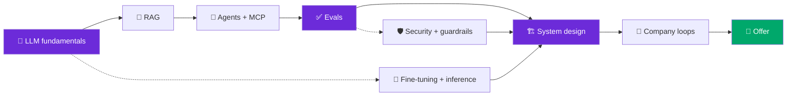

**The deepest, most current prep for the 2026 AI Engineer loop** — real questions, worked system designs, per-company loops, all sourced.

*Maintained by [Landed](https://landed.jobs) — daily AI-native job matches, agent help with every application, and mock-interview prep.*

---

The **AI Engineer** was a #1 fastest-growing US job title, and the loop that gates it has almost nothing to do with LeetCode. In 2026 it tests whether you can **ship reliable products on top of LLMs** — RAG, agents, evals, LLMOps, and AI system design — and reason about them like a senior. This repo is the complete, **sourced** map of that loop: what each round tests, the real questions people were asked, a reusable system-design rubric applied to 10 worked designs, and per-company breakdowns. No fluff, no memorization dumps — mechanism-first, dated 2026.

> ⭐ **Star this repo** — it's the flagship interview guide in the [Landed AI-native jobs family](#part-of-the-landed-ai-native-jobs-family), refreshed as the loop evolves.

## What an AI Engineer interview tests in 2026 — the 5 pillars

Answer-first: five things separate a pass from a reject. Everything in this repo hangs off these.

1. **LLM fundamentals & mechanism** — the generation loop (prefill/decode), tokens, context windows (Lost-in-the-Middle, Context Rot), sampling, KV cache, and enough transformer internals to *implement attention from memory*. → [content/01](content/01-llm-fundamentals.md)
2. **RAG done as an IR problem** — embeddings + ANN, recall@k/precision@k, chunking, hybrid + rerank, and how to debug retrieval *before* the model. → [content/02](content/02-rag.md)
3. **Agents, tools & MCP** — agent-vs-workflow judgment, error compounding, tool/ACI design, MCP, and stateless-model/stateful-harness memory. → [content/03](content/03-agents-and-tool-use.md)
4. **Evals & reliability** — "eval is the new system design": LLM-as-judge (calibrated), pass@k vs pass^k, trajectory vs outcome eval, and gating on a golden set. → [content/04](content/04-evals-and-llm-as-judge.md)
5. **AI system design + LLMOps** — one rubric (framing → data/eval → retrieval/model → serving/latency → guardrails → monitoring/cost → scaling), plus cost/latency, fine-tuning, and security. → [content/07](content/07-ml-and-llm-system-design.md)

> [!TIP]
> The single biggest 2026 shift: interviewers stopped asking "can you call the API?" and started asking "**how do you know it works, and how does it fail?**" Evals, guardrails, and cost are now first-class rounds — not afterthoughts.

> ⭐ If this saved you an hour of prep, **star it** so the next person finds it.

## The interview-loop map

The signature table — what actually happens across an AI Engineer loop, and where to prep each round in this repo. (Loop synthesized from public 2026 processes across OpenAI, Anthropic, DeepMind, Meta, Scale, and applied-AI startups — see [company/](company/) for per-company detail.)

| Round | What it tests | How to prep | Deep link |
|---|---|---|---|
| **Recruiter screen** | Motivation, role-fit, comp, visa | Know the company's philosophy (write-the-model / ship-the-platform / build-the-product) | [company/](company/) |
| **Coding screen** | Python/PyTorch fluency; implement attention / a tokenizer / LoRA from memory | Practice the primitives, not LeetCode grind | [questions/coding](questions/coding.md) · [content/01](content/01-llm-fundamentals.md) |
| **Take-home** | Ship a small RAG/agent app + a written **eval** section | Build the eval first; it's what they grade | [content/04](content/04-evals-and-llm-as-judge.md) · [answers/eval-pipeline](answers/eval-pipeline.md) |
| **AI system design** (signature) | Design ChatGPT / a RAG system / LLM serving / an agent — with numbers | One rubric, applied cold | [answers/system-design-rubric](answers/system-design-rubric.md) |
| **Coding II** | Applied AI-systems coding, streaming, rate-limiter, gRPC service | Real-world building, not puzzles | [questions/coding](questions/coding.md) |
| **AI/ML specialized** | Fine-tuning, quantization, KV cache, RLHF/DPO/GRPO, evals | Depth on post-training + inference | [content/06](content/06-fine-tuning-and-inference.md) |
| **Behavioral + alignment** | End-to-end project ownership; safety debate (esp. Anthropic) | STAR + a real AI project you can defend | [questions/behavioral](questions/behavioral.md) |
| **Team match & offer** | Fit, leveling, comp | Referrals convert far better than cold apps | [Landed →](https://landed.jobs) |

## The prep path

## Contents

- [📖 Content — one concept per file](#-content--one-concept-per-file) (9 deep explainers)
- [❓ Question bank](#-question-bank) (230+ questions, tiered & sourced)
- [🏗️ Worked system designs](#️-worked-system-designs) (1 rubric + 10 designs)
- [🏢 Company loops](#-company-loops) (12 companies, sourced questions)
- [📚 Resource hub](#-resource-hub) (typed, annotated, license-noted)
- [🗓️ Study plan](#️-study-plan) (1-week + 1-month)
- [🆕 What's new (2026-07)](#whats-new-2026-07)
- [❔ FAQ](#faq)
- [🤝 Contributing](#contributing)

---

## 📖 Content — one concept per file

Mechanism-first explainers with senior-trap `> [!WARNING]` callouts, aha-moment `> [!TIP]`s, interview-angle menus, and a capped, typed resource block each.

| # | Topic | What it covers |
|---|---|---|
| 01 | [LLM fundamentals](content/01-llm-fundamentals.md) | Prefill/decode, tokens, context window, sampling, reasoning models, KV cache, attention & transformer internals |
| 02 | [RAG](content/02-rag.md) | Embeddings + ANN, recall@k/precision@k, chunking, hybrid + RRF, reranking, scale math, eval, ACL |
| 03 | [Agents & tool use](content/03-agents-and-tool-use.md) | Agent vs workflow, ReAct, tool/ACI design, error compounding, MCP, memory & state |
| 04 | [Evals & LLM-as-judge](content/04-evals-and-llm-as-judge.md) | Rings of testing, judge calibration, pass@k vs pass^k, trajectory vs outcome, error analysis |
| 05 | [LLMOps — cost & latency](content/05-llmops-cost-latency.md) | Prompt/semantic caching, tiered routing, reliable client, hedging, fallback, silent regressions |
| 06 | [Fine-tuning & inference](content/06-fine-tuning-and-inference.md) | RAG-vs-FT-vs-prompt, LoRA/QLoRA, RLHF/DPO/GRPO, quantization, PagedAttention, speculative decoding |
| 07 | [ML & LLM system design](content/07-ml-and-llm-system-design.md) | The reusable rubric, whiteboard estimation, latency budgets, tradeoff reasoning |
| 08 | [Prompting & structured output](content/08-prompt-engineering-and-structured-output.md) | Static contract vs context, CoT/self-consistency, constrained decoding, schema-as-accuracy |
| 09 | [Security & guardrails](content/09-security-and-guardrails.md) | Prompt injection, the lethal trifecta, EchoLeak, CaMeL/dual-LLM, OWASP LLM Top 10 |

## ❓ Question bank

**230+ questions**, topic-grouped and difficulty-tiered. Multiple-choice entries keep the **per-option "why"** — right *and* wrong — behind a `
` block so you can self-test first. Every "real" question is provenance-labeled: ✅ **Reported** (with source) vs 🔮 **Representative**.

→ **[Browse the full bank](questions/README.md)**

| Topic | File | | Topic | File |
|---|---|---|---|---|
| Fundamentals & transformers | [questions/fundamentals](questions/fundamentals.md) | | Fine-tuning & inference | [questions/fine-tuning](questions/fine-tuning.md) |
| RAG | [questions/rag](questions/rag.md) | | System design | [questions/system-design](questions/system-design.md) |
| Agents & MCP | [questions/agents](questions/agents.md) | | Coding rounds | [questions/coding](questions/coding.md) |
| Evals | [questions/evals](questions/evals.md) | | Behavioral & alignment | [questions/behavioral](questions/behavioral.md) |
| LLMOps | [questions/llmops](questions/llmops.md) | | | |

## 🏗️ Worked system designs

The design round is where most candidates hand-wave. We give you **one reusable rubric** — framing → data/eval → retrieval/model → serving/latency → guardrails → monitoring/cost → scaling — then apply it to **10 original, numeric worked designs** (RAM math, p50/p99 budgets, QPS, cost/month, index choice).

→ **[The rubric](answers/system-design-rubric.md)** · then the designs:

- [RAG over 10M docs](answers/rag-over-10m-docs.md) · [Semantic search](answers/semantic-search.md) · [Support bot](answers/support-bot.md)
- [Agentic workflow](answers/agentic-workflow.md) · [Coding agent](answers/coding-agent.md) · [Eval pipeline](answers/eval-pipeline.md)
- [Content moderation](answers/content-moderation.md) · [LLM inference at scale](answers/llm-inference-at-scale.md)
- [AI candidate sourcing (750M profiles, <500ms)](answers/ai-candidate-sourcing.md) · [Hallucination-free banking chatbot](answers/hallucination-free-banking-chatbot.md)

## 🏢 Company loops

Per-company loops with **verbatim, sourced** questions — the three hiring philosophies, signature rounds, and how to prep each. → **[All companies](company/README.md)**

[OpenAI](company/openai.md) · [Anthropic](company/anthropic.md) · [Google DeepMind](company/google-deepmind.md) · [Meta](company/meta.md) · [Scale](company/scale.md) · [xAI](company/xai.md) · [Databricks](company/databricks.md) · [Perplexity](company/perplexity.md) · [Cohere](company/cohere.md) · [Mistral](company/mistral.md) · [Cursor](company/cursor.md) · [Nvidia](company/nvidia.md)

## 📚 Resource hub

Every link typed (📄 📘 📰 🎬 🧑‍🏫 🛠️ 💻), annotated, and license-noted; capped ~8 per topic. → **[resources.md](resources.md)**

---

## 🗓️ Study plan

### 1 week (you have an onsite booked)

| Day | Focus | Do |
|---|---|---|
| 1 | Fundamentals | [content/01](content/01-llm-fundamentals.md) + [fundamentals Qs](questions/fundamentals.md); implement attention from memory |
| 2 | RAG | [content/02](content/02-rag.md) + [rag Qs](questions/rag.md); memorize the RAM math + 7 failure points |
| 3 | Agents + evals | [content/03](content/03-agents-and-tool-use.md) + [content/04](content/04-evals-and-llm-as-judge.md); pass@k vs pass^k, MCP security |
| 4 | System design | [rubric](answers/system-design-rubric.md) + 3 worked designs out loud |
| 5 | LLMOps + fine-tuning | [content/05](content/05-llmops-cost-latency.md) + [content/06](content/06-fine-tuning-and-inference.md); cost estimation, LoRA/DPO/GRPO |
| 6 | Company + security | Your target's [company page](company/README.md) + [content/09](content/09-security-and-guardrails.md) |
| 7 | Mock | Timed design + behavioral; [book a mock →](https://landed.jobs) |

### 1 month (building toward the loop)

- **Week 1** — Fundamentals + prompting/structured output ([01](content/01-llm-fundamentals.md), [08](content/08-prompt-engineering-and-structured-output.md)). Build a tiny RAG pipeline.
- **Week 2** — RAG + evals ([02](content/02-rag.md), [04](content/04-evals-and-llm-as-judge.md)). Add a golden-set eval harness to your RAG.
- **Week 3** — Agents + LLMOps + fine-tuning ([03](content/03-agents-and-tool-use.md), [05](content/05-llmops-cost-latency.md), [06](content/06-fine-tuning-and-inference.md)). Build an agent loop with traces.
- **Week 4** — System design ([all 10 worked designs](answers/)) + [company loops](company/) + security ([09](content/09-security-and-guardrails.md)). Full mock loop.

---

## What's new (2026-07)

Most recent first. The 2026 AI Engineer loop looks materially different from 2024.

- **🆕 "Eval is the new system design."** Take-homes and onsites now grade your **eval harness** as heavily as your app. We added [content/04](content/04-evals-and-llm-as-judge.md) + [answers/eval-pipeline](answers/eval-pipeline.md) covering pass@k vs pass^k, trajectory vs outcome, judge calibration (Cohen's κ), and CI gating.
- **🆕 MCP fluency is a resume must-have.** Registries list thousands of servers. New coverage of the handshake, rug-pull / tool-poisoning defenses, and the gateway pattern in [content/03](content/03-agents-and-tool-use.md).
- **🆕 Reasoning models reshaped the loop.** o-series/R1-style thinking tokens change trajectories and cost → 2-tier routing per node; when to use a reasoning model vs standard. In [content/01](content/01-llm-fundamentals.md) + [content/05](content/05-llmops-cost-latency.md).
- **🆕 Context engineering** — Anthropic's principles: just-write-context, long-context-doesn't-fix-bad-context, curate-context. Sub-agent architectures and tool-result compression in [content/03](content/03-agents-and-tool-use.md) + [content/08](content/08-prompt-engineering-and-structured-output.md).
- **🆕 Agentic eval as a 3-metric stack** — outcome (task success) · trajectory (steps/tokens, tool-call accuracy) · tool/reasoning (schema compliance). See [content/04](content/04-evals-and-llm-as-judge.md).
- **🆕 Prompt injection is CVE-trackable** — EchoLeak (CVE-2025-32711, CVSS 9.3), the lethal trifecta, CaMeL/dual-LLM defenses. New [content/09](content/09-security-and-guardrails.md).
- **🆕 Post-training moved to GRPO** (DeepSeek-R1) and **FP8** is the default inference precision. Updated [content/06](content/06-fine-tuning-and-inference.md).

---

## FAQ

**Do I need an ML PhD to pass an AI Engineer interview?**
No. Applied-AI and product-AI roles want people who **ship** with LLMs — RAG, agents, evals, cost/latency — not researchers. Frontier labs (OpenAI/Anthropic/DeepMind) weight research more and may ask you to implement attention/PPO from memory, but even there, demonstrated shipping ability carries a real loop. Focus on mechanism + a project you can defend end-to-end.

**Should I grind LeetCode?**
Mostly no. Coding rounds lean **applied** — implement a tokenizer, attention, a LoRA adapter, a rate-limiter, or a small streaming service. A little algorithmic warm-up (LRU cache, tries, sliding-window) helps for the phone screen, but the differentiator is AI-systems fluency, not puzzle speed. See [questions/coding](questions/coding.md).

**AI Engineer vs ML Engineer interview — what's the difference?**
ML Engineer loops skew classic ML (bias/variance, regularization, feature stores, A/B tests, recommender design). AI Engineer loops skew **LLM apps** (RAG, agents, evals, prompting, LLMOps, LLM system design). Some infra-heavy roles ("ship the platform") blend in serving/quantization; research roles ("write the model") add post-training and paper analysis. This repo targets the AI-Engineer/applied-AI center of gravity.

**I have no production LLM experience — can I still pass?**
Yes, if you close the gap deliberately. Build 2–3 real things — a RAG pipeline with a **golden-set eval**, an agent loop with **traces**, and one thing that fails and shows you handled it (a guardrail, a fallback, a cost cut). The loop rewards candidates who can talk about **how it fails and how you'd know**, which you can earn from a weekend project + this repo.

**How long does it take to prepare?**
With a solid Python/ML base: **1 focused week** to cram the loop (see the [1-week plan](#1-week-you-have-an-onsite-booked)). Starting closer to zero on LLM apps: **~1 month** building + studying (see the [1-month plan](#1-month-building-toward-the-loop)).

**What's new for 2026?**
Evals as a first-class round, MCP, reasoning-model routing, context engineering, agentic eval, and CVE-grade prompt-injection defense. See [What's new](#whats-new-2026-07).

**Is this better than the existing AI-interview repos?**
It's the only one we know of that combines **per-lab loops + typed/annotated resources + sourced verbatim questions + a reusable design rubric with 10 worked answers + 2026 topics** in one place. We link the others honestly in [resources.md](resources.md#question-banks--competitor-repos) and tell you where they stop.

---

## Contributing

PRs and issues welcome — add questions, resources, worked answers, or company-loop updates. This is a **curated, sourced** repo: every real question is provenance-labeled and every link is typed + annotated. See **[CONTRIBUTING.md](CONTRIBUTING.md)** for the quality spec and license discipline.

---

### Part of the Landed AI-native jobs family

The umbrella maps every AI-native role; the siblings go deep per role.

- 🧭 [awesome-ai-native-jobs](https://github.com/landedjobs/awesome-ai-native-jobs) — the umbrella that maps the whole AI-native job landscape
- 🔥 [whos-hiring-in-ai](https://github.com/landedjobs/whos-hiring-in-ai) — real hiring posts from founders on X, sorted by role
- 💸 [recently-funded-ai-startups-hiring](https://github.com/landedjobs/recently-funded-ai-startups-hiring) — fresh-capital startups staffing up now
- 🚀 [ai-engineer-jobs](https://github.com/landedjobs/ai-engineer-jobs) — 300 live AI engineer roles, auto-updated
- 🤝 [forward-deployed-engineer-jobs](https://github.com/landedjobs/forward-deployed-engineer-jobs) — FDE & customer-facing engineering
- 📈 [gtm-engineer-jobs](https://github.com/landedjobs/gtm-engineer-jobs) — GTM engineering roles
- 🎓 [ai-fellowships-and-residencies](https://github.com/landedjobs/ai-fellowships-and-residencies) — 75 fellowships, residencies & programs
- 📘 [ai-interview-guides](https://github.com/landedjobs/ai-interview-guides) — 33 company interview guides
- ❓ [ai-interview-questions](https://github.com/landedjobs/ai-interview-questions) — 331 real interview questions with answers
- 🧪 [projects-to-land-an-ai-job](https://github.com/landedjobs/projects-to-land-an-ai-job) — portfolio projects that actually get you hired
- 🗺️ [ai-product-engineer-roadmap](https://github.com/landedjobs/ai-product-engineer-roadmap) — the AI product engineer roadmap
- 📦 [ai-engineer-portfolio-projects](https://github.com/landedjobs/ai-engineer-portfolio-projects) — 80+ buildable portfolio projects

---

### Stop spraying. Get **matched**, get **prepped**, get **Landed**.

Maintained by [Landed](https://landed.jobs) · No affiliation with the companies named. Content MIT-licensed; linked resources retain their own licenses. Questions are provenance-labeled — reported questions cite public sources.

 

