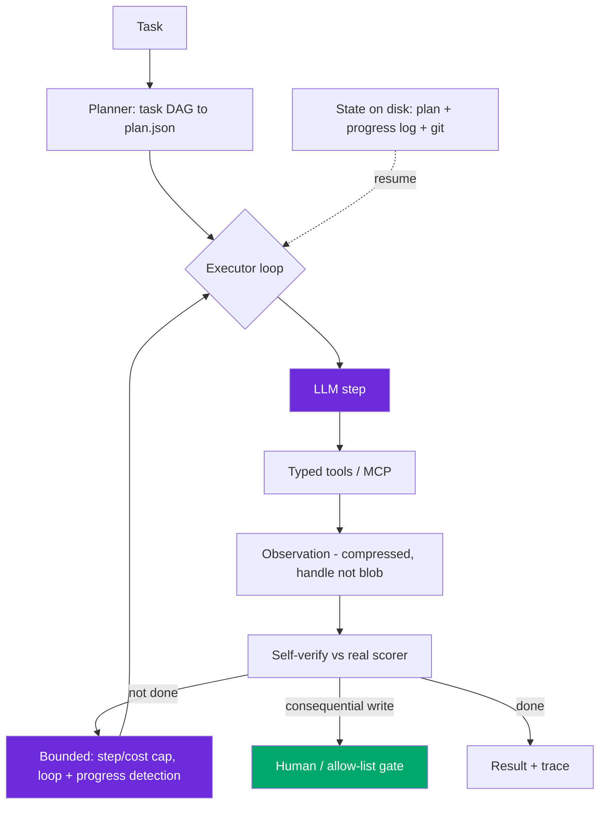

# Design: Agentic Workflow (Planner / Executor + Tools)

> Worked answer using the [AI System-Design Rubric](system-design-rubric.md). Multi-step tool-using agent, bounded + observable + secure.

**Prompt.** *"Design an agent — planner/executor, MCP, function-calling, memory, observability."*

**Provenance.** 🔮 **Representative** — design prompt **D** from the AI-engineer loop research (dev.to "AI System Design Interview Questions" — [source](https://dev.to/arslan_ah/ai-system-design-interview-questions-chatgpt-rag-llm-inference-and-agents-1doi)); one of the most common 2026 rounds. We design a concrete instance: an **operations agent** that answers questions and takes actions across internal systems (tickets, DB, docs).

---

## Stage 1 — Problem framing

The senior framing: an agent is a **loop over `LLM → tool → observation`** whose reliability **compounds multiplicatively**, whose cost grows **super-linearly** with trajectory length, and whose main failure mode is **coordination and security**, not raw model capability. Design the harness, not the prompt.

| Axis | Assumption (state + confirm) |
|------|------------------------------|
| Scope | Task-completion agent: reads across systems, proposes/executes actions, ~5–15 steps |
| Scale | ~50k tasks/day; latency tolerant (async, seconds) but cost-sensitive |
| Freshness | Acts on live system state via tools |
| Tenancy | Per-user permissions; agent inherits least-privilege scope |
| Stakes | Consequential writes (refunds, config changes) — blast radius matters |
| Latency | Task-level SLA (seconds to minutes); per-step p99 bounded |

Reliability math to state: at 95% per-step reliability, `0.95^10 ≈ 60%`, `0.95^20 ≈ 36%`. **The system is shippable because failures are caught and recovered, not because the agent is usually right** (Devin: 13.86% on SWE-bench, yet productized behind recovery).

---

## Stage 2 — Data & eval set

Build evals **before** the agent. Two suites: **capability** (climbs from low; graduates into regression once saturated) and **regression** (sits near 100%, gates CI). Report **pass^k, not pass@k** — at 90% per-attempt, `pass@5 = 99.999%` (flattering) but `pass^5 = 0.9^5 = 59%` (the user-facing truth). Grade the **trajectory** (tool choice, argument correctness, ordering, step efficiency), not just the end state — a broken path that happened to land is a latent failure. Build the golden set from **real failure traces** via error analysis (50–100 traces → open-code → cluster → targeted eval on the top mode).

---

## Stage 3 — Architecture / pattern choice

**Baseline:** a single ReAct loop (`Thought → Action → Observation`). Prefer it — Cognition's rule: **shared writes → single linear agent**. Only go multi-agent for **parallel reads + one synthesizing writer**, and know the cost: Anthropic's research system is +90.2% quality but **~15× tokens**; Augment's 3-agent setup is **~10× cost** from handoffs re-sending context. Multi-agent is justified only on high-value tasks (a $20 report, not a $0.0001 chat turn).

| Pattern | Use when |
|---------|----------|
| ReAct (single) | Open-ended, reads state between steps; the default |
| Plan-then-execute | Codified workflow; cheaper (planner + small executor); also a security control |
| Evaluator-optimizer | Stable rubric + a real verifier lifts quality |
| Orchestrator-worker | Subtask count unknown up front; workers are smaller/cheaper |

**Tool design (ACI) matters more than the prompt.** Keep the set **< 20** (past 20–40, selection accuracy degrades; Anthropic's API caps at 20 tools/24 params/16 unions). Poka-yoke: enums over free-form strings, absolute paths, return **handles not blobs** (a 50k-token return poisons context), a worked example + explicit boundary per tool. **Structured errors**: TRANSIENT (retry within budget) / PERMANENT (change approach) / REQUIRES_HUMAN (escalate).

---

## Stage 4 — Serving & latency (the harness)

**Bounded loop** is the core reliability construct:
- Step cap + **cost ceiling** (kill at $X, not just N steps) + **semantic loop detection** (catch re-issued near-identical calls).
- Retry budget 2–3/turn, classified by error type.
- **Self-verification against a real scorer** (compiler+tests for code, schema for tools, calibrated judge for research).
- Progress detection: no new info in K steps → escalate or stop.

**Context engineering** — cost grows super-linearly (10-step trajectory ≈ 55k cumulative input tokens, not 10k, because the transcript re-sends). Levers in order: (1) prompt-cache the stable system+tools prefix (0.1× reads), (2) compress observations, (3) prune stale turns, (4) externalize large state to disk. **State-on-disk** (`plan.json` + append-only `progress.log` + git checkpoints) makes the agent resumable — the window is a cache, files are the database.

**MCP** turns M models × N tools into M+N. stdio ~50–150 ms/call, HTTP/SSE 200–500 ms+/call — so use in-process tools for a single latency-sensitive agent, MCP for multi-vendor/team reuse. Enable servers per-workspace, not globally (avoids re-inflating tool overload).

---

## Stage 5 — Eval & guardrails (security is the round)

The **lethal trifecta** (Simon Willison): private data + untrusted content + external egress. With all three, an attacker exfiltrates via injection. **Break a leg of the trifecta.** Indirect-injection baseline ASR is **73.2%**; layered defense drops it to **8.7%** (still ~1-in-12 — never rely on filtering alone).

| Layer | Control |
|-------|---------|
| Input | Jailbreak/intent classifier |
| Retrieval | Scan untrusted content (spotlighting, taint-tracking) |
| Architecture | **CaMeL / dual-LLM** — privileged planner never sees raw untrusted text; quarantined LLM reads it but can't call tools; plan fixed before untrusted data is read |
| Tool | Validate args, least privilege, allow-list, no `shell_exec` |
| Output | Strip outbound URLs/images (the GeminiJack zero-click exfil vector) |
| Human | **Tiered approval — gate the write, not the thought** (auto-approve reads; queue moderate writes; hard-block irreversible actions) |
| Sandbox | fs + network namespaces to contain blast radius |

---

## Stage 6 — Monitoring & cost

**Span tracing** — a trace is a tree of spans (each generation and tool call a span) with inputs/outputs (redacted), token cost, latency, tool args, structured error tag, session ID. **~46% of agent POCs fail on the observability gap** (staging inputs are curated; production is untrusted content that perturbs trajectories).

**Cost is the leading regression signal** — it moves before quality (super-linear re-send amplifies one extra call). Alarm on **cost-per-resolved-task** and **steps-per-task (p95)** vs the 7-day median; final-answer quality is lagging (users already hit it). Anthropic's postmortem: two months of "it got dumber" was three interacting changes no single commit explained — only production traces isolated it.

**Cost/task:** `steps × (avg_in × price_in + avg_out × price_out)`, with input growing per step. Cheapest-first levers: cache prefix → trim observations → cut steps → route cheap → smaller model.

---

## Stage 7 — Scaling

- Rollout ladder: **shadow (30-day, mine disagreements for the golden set) → canary 1–5% → A/B → full**, with online-eval graders on live traces.
- CI gate on **pinned model + prompt versions** — the only defense against a silent provider model update weeks later.
- Multi-agent only where unit economics justify the ~10–15× token multiplier.

> [!WARNING]
> **Trap 1 — reaching for multi-agent by default.** It's +90% quality but ~15× cost and adds 14 documented coordination failure modes. Prefer a single linear agent unless the task is parallel-read + high-value. "Don't build multi-agents" is the senior instinct.

> [!WARNING]
> **Trap 2 — evaluating only the end state, and ignoring the trifecta.** A trajectory can be broken yet land; grade the path. And an agent with private data + untrusted input + egress is exploitable via zero-click injection — break a leg (CaMeL/dual-LLM) and gate consequential writes.

---

## What a strong vs weak candidate says

| | Weak | Strong |
|-|------|--------|
| Architecture | "Use a multi-agent system" | Single ReAct default; multi-agent only for parallel-read/high-value (15× cost) |
| Reliability | "The agent completes the task" | 0.95^10≈60%; bounded loop + classified retries + real-scorer verification |
| Eval | "Check it works" | Trajectory-graded, pass^k, capability+regression, CI on pinned versions |
| Security | "Add a filter" | Break the lethal trifecta (CaMeL/dual-LLM); tiered write-gate; ASR 73%→8.7% |
| Cost | "Pay per call" | Super-linear (~55k not 10k tokens); prefix cache; cost-per-task as leading alarm |

---

## Follow-ups they'll push on

- **"When sub-agents vs stuffing context?"** → Sub-agents for parallel reads that fan back to one writer; otherwise context engineering (compress/prune/externalize) beats the token multiplier.
- **"How do you compress tool results exceeding the window?"** → Return handles/summaries, write blobs to disk, prune stale turns; context rot makes the model reason worse, not just slower.
- **"Evaluate a reliability SLA."** → pass^k on golden set; report the all-k-succeed number, not pass@k.
- **"Walk an MCP handshake."** → client `initialize` → server advertises tools/resources/prompts → `tools/list` → `tools/call`; pin versions, allow-list, gateway for org scale.
- **"A tool returns 503 vs 404 — what should the agent do?"** → 503 = TRANSIENT (retry after backoff within budget); 404 = PERMANENT (change approach); permission denial = REQUIRES_HUMAN.

---

**Nav:** [← README](../README.md) · [System-Design Rubric](system-design-rubric.md)

Maintained by [Landed](https://landed.jobs) · No affiliation with the companies named. MIT-licensed. Updated 2026-07.

