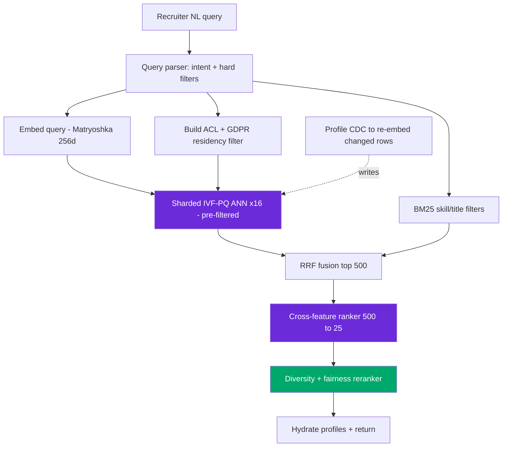

# Design: AI Candidate Sourcing — 750M Profiles, Semantic Search, <500 ms

> Worked answer using the [AI System-Design Rubric](system-design-rubric.md). 750M profiles, natural-language recruiter queries, p99 < 500 ms.

**Prompt.** *"Design an AI candidate-sourcing system: 750M profiles, semantic search, sub-500 ms latency."*

**Provenance.** ✅ **Reported** — design prompt **J**, from "Every AI Engineer Interview Question You Need in 2026, from 100 Real Interviews" ([Adil Shamim, Medium](https://adilshamim8.medium.com/every-ai-engineer-interview-question-you-need-to-know-in-2026-from-100-real-interviews-b5b7ae4b961a)). This is a LinkedIn/recruiting-scale retrieval prompt — the 750M number is roughly LinkedIn's member base.

---

## Stage 1 — Problem framing

The hard part is **750M vectors under 500 ms** with **structured filters** (location, seniority, skills, availability) that a pure semantic search ignores. Frame it as **filtered semantic retrieval + ranking**, not classification.

| Axis | Assumption (state + confirm) |
|------|------------------------------|
| Scope | Recruiter types "senior Rust engineer, fintech, open to remote in EU" → ranked candidate list |
| Scale | **750M profiles**; ~50k recruiters, ~2M searches/day ≈ **23 avg / ~70 peak QPS** |
| Freshness | Profile edits searchable within minutes; new members within an hour |
| Tenancy | Recruiter-level ACLs; GDPR — EU profiles have data-residency + right-to-be-forgotten |
| Stakes | Bias/fairness is legally load-bearing (EEOC); a bad rank wastes recruiter time |
| Latency | **p99 < 500 ms** end-to-end |

---

## Stage 2 — Data & eval set

The eval signal is **recruiter feedback**: profile clicks, InMail sends, and — the real label — **positive responses / hires** (delayed by weeks, like fraud chargebacks). Don't treat "click = good candidate"; predict downstream response. Golden set: 200 (query, judged-relevant-profiles) pairs curated with recruiters, plus a **fairness eval slice** (does ranking quality hold across gender/ethnicity proxies?). Targets: **recall@100 ≥ 0.9** on the retrieval stage, NDCG@25 on ranking, and a demographic-parity guardrail.

---

## Stage 3 — Retrieval / model choice

**Baseline:** Elasticsearch BM25 over profile text + boolean filters. Recruiters already use this; semantic search must beat it on paraphrase/intent queries.

**Two-stage funnel** (retrieval needs ANN over 750M; ranking can afford a heavy model on the shortlist):

**Stage A — filtered ANN retrieval.** Embed the query and the profile (skills, titles, summary) into a shared space. **RAM math is the crux:**
```
750M × 1,024-d × 4 bytes = ~3.1 TB raw (fp32)  → impossible on one box
→ IVF-PQ: ~20× compression ≈ 150 GB, recall 0.80–0.92
→ or int8 scalar quantization: ÷4 ≈ 770 GB, higher recall
→ Matryoshka-truncate 1,024-d → 256-d for stage-1 ANN
```
Use **IVF-PQ sharded across ~16 nodes** (~10 GB/shard), scatter-gather. **Filter before ANN** — GDPR residency and recruiter ACL and hard filters (location/seniority) applied as a pre-filter or partitioned index, never post-filter (post-filter returns < k and wrecks recall on selective queries).

**Stage B — learned ranking.** A cross-feature ranker (profile × query × recruiter-context features) scores the top ~500 → top 25, optimizing predicted positive-response, with recency and diversity in a reranker.

**Where embeddings fail here:** exact skills ("CUDA", "SOC 2"), negation ("not a manager"), and seniority/temporal precision ("8+ years") — so **hybrid** (dense + BM25 filters) is mandatory, fused with RRF.

---

## Stage 4 — Serving & latency

```
500 ms p99 = query embed 20ms + ACL/GDPR filter build 10ms
           + sharded IVF-PQ ANN (16 shards, scatter-gather) 120ms
           + BM25 filter 30ms + RRF 5ms
           + cross-feature rank(500→25) 180ms + hydrate profiles 60ms + buffer
```



LinkedIn's real move here: they **collapsed five legacy retrieval systems into one LLM dual-encoder and got 75× throughput** by investing in signal quality, not field count — cite it.

---

## Stage 5 — Eval & guardrails

- **Fairness guardrail** — demographic-parity / equalized-odds check on the ranked list; this is legally required for hiring tools, not optional. Counter-metric to relevance.
- **ACL + GDPR** enforced as retrieval filters; right-to-be-forgotten = a delete that must propagate through the ANN index (tombstone + scheduled compaction).
- **Query understanding guardrail** — reject/expand ambiguous queries rather than returning noise.
- Offline NDCG is a gate; the verdict is the online metric.

---

## Stage 6 — Monitoring & cost

**Cost/month** (mostly infra, not tokens — embeddings are precomputed):
```
16 ANN shards (RAM-heavy instances) + ranker GPUs + ES cluster
≈ dominated by ~150 GB–770 GB resident vector RAM across shards
Embedding refresh: CDC re-embed only changed profiles (~few % daily)
```
**Monitor:** the online business KPI (recruiter → positive-response rate), NDCG on a probe set, **top-k overlap** for index-drift, fairness metrics per week, shard latency (p99 tail on the slowest shard bounds scatter-gather), and freshness lag.

---

## Stage 7 — Scaling

- **750M vectors → shard the IVF-PQ index** by hash; the slowest shard's p99 sets the scatter-gather latency, so balance shard sizes and over-provision the tail.
- **Profile updates** are delete-plus-insert at the chunk level; a naive "re-embed profile" can orphan stale vectors under old IDs.
- **Multi-region** for GDPR — EU profiles stay in EU; the query fans out only to permitted regions.

> [!WARNING]
> **Trap 1 — post-filtering the ANN.** Applying location/seniority/ACL filters *after* the ANN walk returns fewer than k candidates and silently tanks recall on selective recruiter queries. Pre-filter or partition the index by common filter values.

> [!WARNING]
> **Trap 2 — ignoring fairness/legal.** A candidate-ranking system is a regulated hiring tool. Optimizing pure relevance without a demographic-parity guardrail is both an ethics and a legal failure — name it unprompted.

---

## What a strong vs weak candidate says

| | Weak | Strong |
|-|------|--------|
| Scale | "Put 750M vectors in a vector DB" | 750M×1024×4 = 3.1TB → IVF-PQ 150GB sharded ×16 |
| Filters | "Filter the results" | Pre-filter/partition before ANN (ACL+GDPR+hard filters); post-filter returns <k |
| Retrieval | "Semantic search" | Two-stage: filtered ANN retrieval → cross-feature ranker; hybrid for exact skills |
| Fairness | (silent) | Demographic-parity guardrail as counter-metric; GDPR right-to-be-forgotten |
| Latency | "It'll be fast" | 500ms budget: 120ms scatter-gather ANN + 180ms rank; slowest shard bounds tail |

---

## Follow-ups they'll push on

- **"How do you keep 750M embeddings fresh?"** → CDC re-embed only changed profiles; never mix embedding generations (representation shearing); dual-index migration.
- **"Recruiter searches for an exact certification and gets fuzzy matches."** → Embeddings blur exact tokens; hybrid BM25 filter on the certification field.
- **"How do you handle right-to-be-forgotten?"** → Delete propagates as an ANN tombstone + compaction; verify the vector is gone from all shards.
- **"Cold-start a brand-new member with a thin profile."** → Fall back to structured filters + text BM25 until enough signal to embed well.
- **"How do you rank, given no ground-truth 'best candidate'?"** → Predict downstream positive-response (delayed label); recruiter feedback loop; NDCG on curated golden pairs.

---

<div align="center">

**Nav:** [← README](../README.md) · [System-Design Rubric](system-design-rubric.md)

<sub>Maintained by [Landed](https://landed.jobs) · No affiliation with the companies named. MIT-licensed. Updated 2026-07.</sub>

</div>
