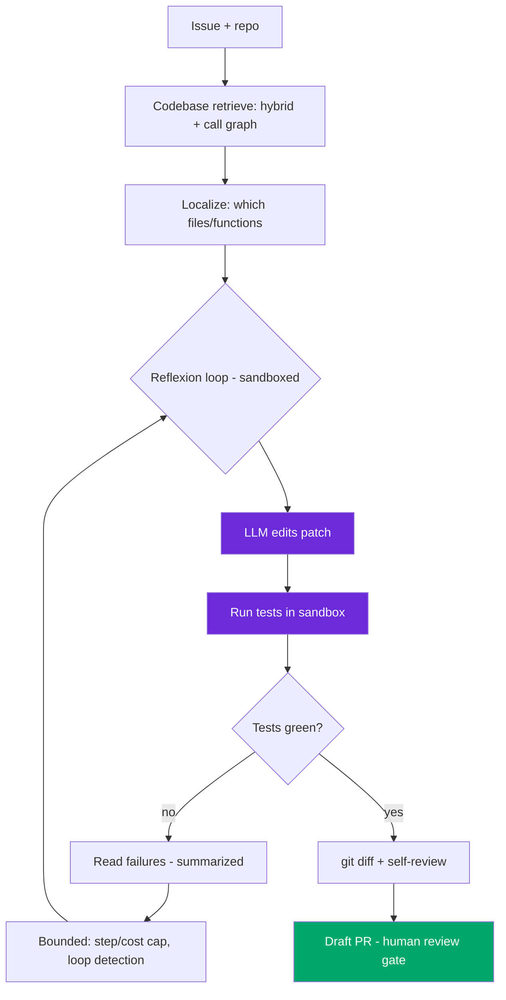

# Design: Coding Agent (SWE-bench-style)

> Worked answer using the [AI System-Design Rubric](system-design-rubric.md). Resolve GitHub issues autonomously in a sandbox, verified by tests.

**Prompt.** *"Design a coding agent that resolves software issues — retrieve over the codebase, generate a patch, run tests, iterate."*

**Provenance.** 🔮 **Representative** — a canonical 2026 prompt (Cursor/Anysphere, GitHub Copilot Agent, Devin-style), corroborated by the "Coding with AI" round Meta added and Cursor's 8-hour paid onsite. Grounded in SWE-bench methodology.

---

## Stage 1 — Problem framing

A coding agent is an **agent with a real verifier** — the test suite. That's the whole design advantage: unlike open-ended agents, you can *check* correctness, so Reflexion-style iterate-to-close works (HumanEval ~91 pass@1). Frame it as: retrieve → edit → run tests → reflect, in a sandbox.

| Axis | Assumption (state + confirm) |
|------|------------------------------|
| Scope | Given an issue + repo, produce a passing patch (or a reviewed draft PR) |
| Scale | ~10k issues/day across repos; latency-tolerant (minutes), cost-sensitive |
| Freshness | Operates on repo HEAD; retrieves current code |
| Tenancy | Per-repo isolation; the agent's sandbox has scoped credentials |
| Stakes | A bad merge breaks prod; untrusted repo content is an injection vector |
| Latency | Task-level (1–10 min); bounded by step + cost caps |

Ground truth: Devin resolves **13.86%** of SWE-bench autonomously (86% of attempts fail) — so the product is the **recovery + human-review harness**, not the raw agent. Claude climbed SWE-bench Verified 40% → 80%+ with better harnessing.

---

## Stage 2 — Data & eval set

**SWE-bench Verified** style: (issue, repo@commit, hidden test) triples. The test is the grader — **pass = the hidden test goes green without breaking existing tests**. Report **pass^k** for reliability (all-k-succeed), not pass@k (flatters). Two suites: capability (climbs) and regression (gates CI). Grade the **trajectory** — CORE-Bench was stuck at 42% due to internal NaNs in tool-call arguments; after the fix, **95%** — caught only by **span-level trajectory grading**, not output-only eval. A **0% pass@100 usually means a broken task** (impossible grader, missing tool), not an incapable agent.

---

## Stage 3 — Architecture / retrieval choice

**Baseline:** feed the whole file the issue mentions + a diff prompt, run tests. Beats it? Then add retrieval.

- **Codebase retrieval** — hybrid: embeddings for semantic ("where is auth handled") + BM25 for exact symbols (function names, error strings — where dense embeddings fail). Index by symbol + file + call graph; retrieve relevant files, not the whole repo (context rot).
- **Reflexion loop** (verifier available): generate patch → run tests → read failures → revise. Bounded by step + cost caps.
- **Tool set (< 20):** `read_file`, `grep`, `edit_file` (absolute paths, enums), `run_tests`, `git_diff`. Return handles/summaries — a full test log is a 50k-token blob that poisons context; return the failing assertions.
- **Model choice:** a strong coding model for edits; a cheaper model for retrieval/summary sub-steps (routing).

---

## Stage 4 — Serving & latency (sandboxed loop)

Every run in an **ephemeral sandbox** (fs + network namespaces) — untrusted repo code executes here, contained.



**State on disk** — plan + progress log + git checkpoints make long runs resumable; on context reset, resume from the plan with no lost work. **Prompt-cache** the stable system+tools prefix (0.1× reads).

---

## Stage 5 — Eval & guardrails

- **Tests are the guardrail** — never merge on the model's say-so; the hidden/existing suite must pass. Green tests + no regressions is the gate.
- **Human review** on the PR — gate the *merge* (the consequential write), not the reasoning. Tiered: auto for low-risk repos, mandatory review for prod paths.
- **Injection defense** — a repo issue title / PR body / HTML comment can hijack the agent (2026: Claude Code Security Review, Gemini CLI, Copilot Agent hijacked this way to steal API keys). Break the trifecta: scoped credentials, sandbox egress control, treat repo content as untrusted.
- **Semantic loop detection** — catch the agent re-applying the same failing edit.

---

## Stage 6 — Monitoring & cost

**Cost/task:** `steps × (avg_in × price_in + avg_out × price_out)` — super-linear because the transcript + test logs re-send. Anthropic's $124.70 build showed much of the waste was retrying ambiguous failures; classifying tool errors (TRANSIENT vs PERMANENT) is a direct cost lever. **Monitor** resolution rate, **cost-per-resolved-issue** and **steps-per-issue** (leading signals — a prompt tweak adding a tool call shows in cost first), sandbox timeouts, and test-flakiness (a flaky test poisons the verifier signal).

```
per_issue ≈ ~8 steps × (~6k in × $3/M + ~800 out × $15/M) growing per step
          ≈ a few $ per resolved issue; cache + trim to cut it
```

---

## Stage 7 — Scaling

- Parallelize across issues (each in its own sandbox); the sandbox pool + test-run compute is the scaling bottleneck, not the LLM.
- CI gate on pinned model + prompt versions.
- Graceful degradation: on repeated failure, hand a partial diff + analysis to a human rather than merging or looping forever.

> [!WARNING]
> **Trap 1 — trusting the model instead of the tests.** The verifier (test suite) is the entire reason a coding agent is shippable at 14% raw success. Never gate on "the model says it's fixed" — gate on green tests + no regressions, and watch for flaky tests that corrupt the signal.

> [!WARNING]
> **Trap 2 — running untrusted repo code unsandboxed with broad credentials.** Issue/PR text is an injection vector that has stolen API keys in the wild. Ephemeral sandbox, scoped creds, egress control, and treat all repo content as untrusted input.

---

## What a strong vs weak candidate says

| | Weak | Strong |
|-|------|--------|
| Verification | "The model writes the fix" | Tests are the verifier; Reflexion loop; gate on green + no regressions |
| Retrieval | "Feed it the repo" | Hybrid (BM25 for symbols) + call graph; retrieve files not whole repo |
| Eval | "See if it passes" | SWE-bench-style hidden tests; pass^k; trajectory grading (CORE-Bench 42%→95%) |
| Security | "It's just code" | Sandbox + scoped creds; issue/PR text is injection; break the trifecta |
| Cost | (silent) | Cost/resolved-issue; classify tool errors to stop wasteful retries |

---

## Follow-ups they'll push on

- **"Why does trajectory grading matter for coding agents?"** → CORE-Bench 42%→95% after a NaN-in-tool-args fix invisible to output-only eval.
- **"0% pass@100 — is the model useless?"** → Almost never; usually a broken task (impossible grader, missing tool) or a correct refusal.
- **"How do you retrieve over a huge monorepo?"** → Symbol + embedding hybrid index, call-graph expansion, localize before editing; don't stuff the repo.
- **"The agent keeps re-applying a failing patch."** → Semantic loop detection + progress detection + step/cost caps; escalate with the partial diff.
- **"How do you stop it from leaking secrets?"** → Scoped ephemeral credentials, sandbox egress control, treat repo/issue text as untrusted; strip outbound URLs.

---

<div align="center">

**Nav:** [← README](../README.md) · [System-Design Rubric](system-design-rubric.md)

<sub>Maintained by [Landed](https://landed.jobs) · No affiliation with the companies named. MIT-licensed. Updated 2026-07.</sub>

</div>
