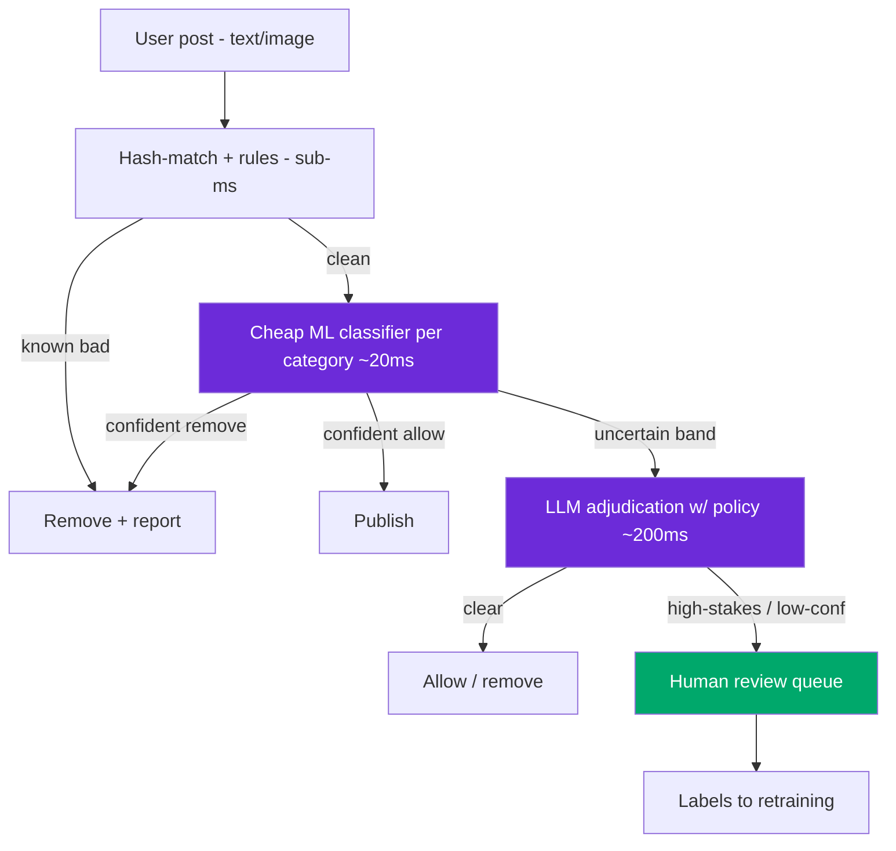

# Design: Content Moderation System

> Worked answer using the [AI System-Design Rubric](system-design-rubric.md). Cheap-filter → ML → LLM cascade, p99 ≤ 300 ms inline.

**Prompt.** *"Design a content-moderation system for a platform with user-generated content."*

**Provenance.** 🔮 **Representative** — a common trust-and-safety round (corroborated by OpenAI's "how would you make ChatGPT safe from jailbreaks?" and the spam-detection framing in the ML system-design methodology). It exercises the layered-cascade shape and asymmetric-cost framing.

---

## Stage 1 — Problem framing

Moderation is a **layered cascade** (cheap rules → ML → LLM → human review), not one model — because 99%+ of content is benign and you can't afford an LLM on every post. Frame the **asymmetric cost**: a false negative (harmful content served) is a brand/legal/safety event; a false positive (benign content removed) is a wronged user + appeals load. Write the objective in those terms, not F1.

| Axis | Assumption (state + confirm) |
|------|------------------------------|
| Scope | Classify UGC (text/image) into policy categories; act (allow / flag / remove / escalate) |
| Scale | 500M posts/day ≈ 5.8k avg / ~20k peak QPS |
| Freshness | Adversaries adapt hourly (new slang, evasion) — concept drift is constant |
| Tenancy | Per-locale policy variants; legal (CSAM, terrorism) is mandatory-report |
| Stakes | **Very high** — both directions; regulated in many jurisdictions |
| Latency | Inline pre-publish for high-risk (**p99 ≤ 300 ms**); async for the rest |

---

## Stage 2 — Data & eval set

Labels come from **human moderators** (delayed, noisy, expensive) + user reports (noisy, gameable). Build a golden set per policy category with **binary pass/fail**, and — critically — **stratify by category**, because accuracy on a 0.1%-prevalence class is meaningless. Metric: **recall at a fixed precision per category** (e.g. hate-speech recall @ 95% precision), reported in **business terms** (harmful-posts-served, appeals-overturned), not raw accuracy. The counter-metric is **false-removal rate**. Grow the adversarial slice from every evasion caught.

---

## Stage 3 — Model choice (the cascade)

**Baseline / floor:** a hash-match + keyword/regex blocklist catches known-bad in sub-milliseconds for free — always ship it. ML only earns its place if it beats the blocklist by a meaningful margin on the residual (the "is this even ML?" check).

**Three-layer cascade:**
1. **Rules / hash-match** (sub-ms) — known CSAM hashes (PhotoDNA-style), banned terms, blocked domains. Handles the easy majority.
2. **Cheap ML classifier** (~10–20 ms) — a fine-tuned small text classifier + an image CNN/CLIP embedding classifier, scoring each policy category. Handles the bulk of the tail.
3. **LLM adjudication** (~200 ms+) — only for the **uncertain band** and nuanced context (satire, reclaimed slurs, coded language). A multimodal LLM with the policy in context, reserved for < 5% of traffic to control cost.
4. **Human review** — the highest-uncertainty/highest-stakes band + all appeals; their labels feed retraining.

The senior instinct: **"ML everywhere" loses to "rules floor + cheap ML tail + LLM on the uncertain band + human review."**

---

## Stage 4 — Serving & latency

```
300 ms p99 (inline high-risk) = hash/rules 2ms + cheap ML score 20ms
    + [only if uncertain] LLM adjudication 220ms + action 20ms + buffer
Most traffic exits at the rules or cheap-ML layer well under 50ms.
```



High-risk categories run **inline (pre-publish)**; lower-risk run **async** post-publish to keep the hot path fast. Cache repeated/near-duplicate content (perceptual hashing) so a viral repost isn't re-scored.

---

## Stage 5 — Eval & guardrails

- **Per-category thresholds** set by policy severity — CSAM/terrorism tuned to max recall (accept more false positives); low-severity tuned to protect false-removal.
- **Appeals loop** is a first-class guardrail — a wronged user must be reinstatable; overturned-appeal rate is a monitored metric.
- **Adversarial robustness** — evasion (leetspeak, image text, benign-looking coded language). The LLM layer + an adversarial eval slice + fast retraining are the defense.
- **Human safety** — route graphic content carefully; the review UI is part of the design.

---

## Stage 6 — Monitoring & cost

**Cost** is dominated by keeping the LLM layer at < 5% of traffic:
```
500M/day: rules+cheap-ML on 100% (cheap) + LLM on ~5% (25M) × ~$0.002 ≈ $50k/day LLM
→ push more resolution into cheap ML to shrink the LLM band; batch async
```
**Monitor** the business KPI (harmful-content prevalence served + appeals-overturned), **concept-drift** tripwires (PSI on score distributions; a BIN-attack-style evasion cluster shows as a sudden category spike), category-level precision/recall, and the human-review queue depth. "Watch accuracy" is wrong — adversaries make it a moving target; watch prevalence + drift.

---

## Stage 7 — Scaling

- Stateless classifiers scale horizontally on QPS; the **human-review queue is the real bottleneck** — tune uncertainty thresholds to protect moderator capacity.
- **Fast retraining loop** — because concept drift is constant (new evasion tactics), retrain the cheap ML on fresh moderator labels frequently, gated by shadow → canary.
- Graceful degradation under a spike: fall back to rules + cheap ML (skip the LLM band) rather than delay publishing indefinitely; err toward flag-for-review on high-risk.

> [!WARNING]
> **Trap 1 — one big LLM classifier on everything.** At 500M posts/day an LLM per post is financially impossible and slow. The cascade (rules floor → cheap ML tail → LLM on the uncertain <5% → human review) is the only shape that hits cost and latency. "ML everywhere" is the junior answer.

> [!WARNING]
> **Trap 2 — a symmetric metric and a static model.** F1/accuracy ignore that false-negative and false-positive costs differ by category and that adversaries adapt continuously. Set per-category recall@fixed-precision thresholds, build an appeals loop, and retrain fast against an adversarial eval slice.

---

## What a strong vs weak candidate says

| | Weak | Strong |
|-|------|--------|
| Shape | "Train a classifier on all content" | Cascade: rules floor → cheap ML → LLM on uncertain <5% → human review |
| Metric | "Maximize accuracy/F1" | Per-category recall@fixed-precision; harmful-served + appeals as business units |
| Cost | "Run the model on everything" | Keep LLM at <5% of traffic; perceptual-hash cache; async for low-risk |
| Drift | "Retrain occasionally" | Concept drift is constant; adversarial slice; fast gated retrain; PSI tripwires |
| Ops | (silent) | Appeals loop; human-queue is the bottleneck; graceful degradation to rules |

---

## Follow-ups they'll push on

- **"How do you catch a brand-new evasion tactic?"** → Concept-drift monitoring (score-distribution PSI) + unsupervised anomaly layer for the unlabeled tail + LLM adjudication + fast retrain on new labels.
- **"How do you set the threshold?"** → Per-category by severity and asymmetric cost, not F1 — CSAM to max recall, low-severity to protect false-removal.
- **"A viral post is re-scored a million times."** → Perceptual/hash caching of near-duplicates; score once, cache the verdict.
- **"Moderators are overwhelmed."** → Tune uncertainty thresholds to cap the queue; active learning to send only the most informative cases; auto-resolve the confident bands.
- **"Multimodal / image-in-text evasion."** → OCR + CLIP embeddings into the cheap ML layer; LLM multimodal adjudication for the uncertain band.

---

<div align="center">

**Nav:** [← README](../README.md) · [System-Design Rubric](system-design-rubric.md)

<sub>Maintained by [Landed](https://landed.jobs) · No affiliation with the companies named. MIT-licensed. Updated 2026-07.</sub>

</div>
