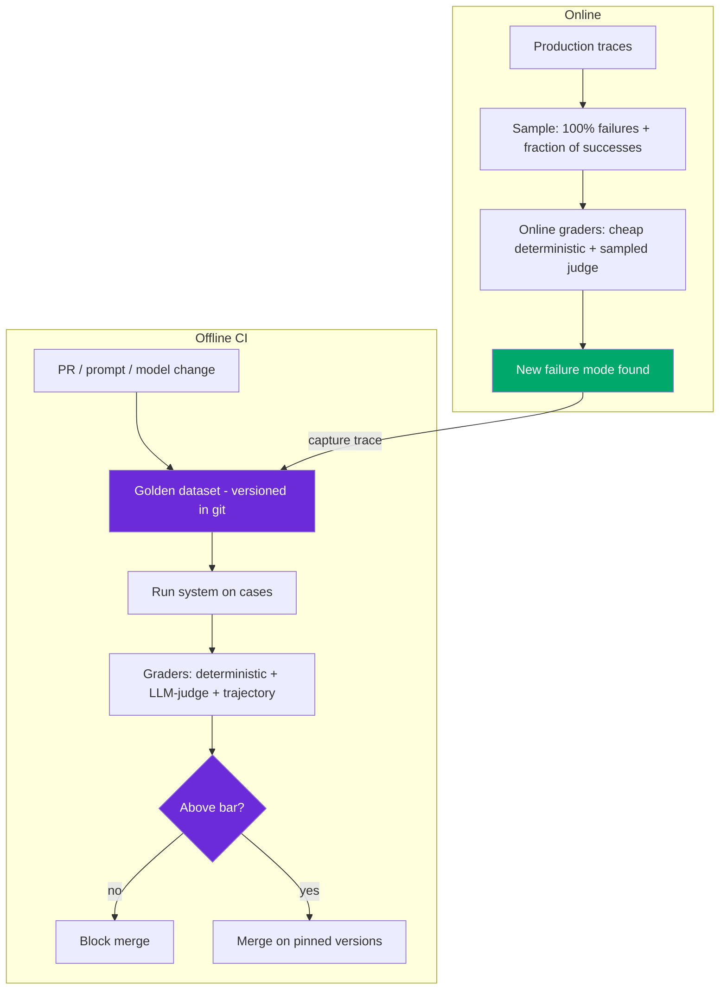

# Design: LLM Eval Pipeline ("Eval is the New System Design")

> Worked answer using the [AI System-Design Rubric](system-design-rubric.md). Offline + online eval, LLM-as-judge, CI gates.

**Prompt.** *"Design an evaluation pipeline for an LLM feature — before you write the feature."*

**Provenance.** 🔮 **Representative** — the 2026 signature prompt ("eval is the new system design"), an OpenAI reported round ("design an evaluation pipeline"), and the canonical probe "design an eval harness for a support agent before you write the agent." Backed by Braintrust / DeepEval / Hamel Husain's methodology.

---

## Stage 1 — Problem framing

Reframe first: **evals are the working spec.** You don't measure a system you already built — you define the metric, build the dataset, and gate every change on it, from day one. The pipeline serves three jobs: **capability** (are we improving?), **regression** (did we break something?), and **online** (is production drifting?).

| Axis | Assumption (state + confirm) |
|------|------------------------------|
| Scope | Eval harness for an LLM feature (say, a support/RAG agent) — offline + online |
| Scale | Golden set 200–1,000 cases; run on every PR + sampled continuously in prod |
| Freshness | Grow the set from production traces weekly |
| Tenancy | Redact PII in traces at the SDK before they leave the process |
| Stakes | A silent provider model update can regress quality weeks later — CI is the only defense |
| Latency | CI eval < ~10 min to not block devs; online graders cheap + sampled |

---

## Stage 2 — Data & eval set (the core deliverable)

**Error analysis first** (Hamel Husain): collect 50–100 real traces → **open-code** one note per trace → **axial-code** into failure modes → build a targeted eval for the top mode → fix → re-read. Stop at saturation.

- **Harvest golden cases from production**, not hand-picked ideals — a hand-picked RAG gold set showed 0.91 offline recall but 0.40 in production.
- **Binary pass/fail** per criterion, not 1–5 Likert (reviewers regress to the middle).
- **Capability vs regression:** capability evals start low and climb (SWE-bench 40%→80%); once saturated they **graduate into the regression suite** that sits near 100% and gates CI.

---

## Stage 3 — Grader choice

**Baseline:** deterministic checks (exact match, regex, schema validation, "did it cite a source", JSON parses). Cheap, unambiguous — use them wherever possible before reaching for a judge.

**LLM-as-judge** for the subjective residual, with the bias playbook baked in:

| Bias | Mitigation |
|------|-----------|
| Position (GPT-4o picks first ~64%; robustness drops below 0.5 with 3–4 options) | Randomize order, average |
| Verbosity (longer scores higher) | Length-normalize / criterion-specific |
| Self-preference (self-enhancement 16.1 vs 8.91) | **Judge ≠ generator family** |
| Hallucinated grades | Give the judge an explicit "Unknown" option |

Make judges **binary + criterion-specific** with a written pass/fail definition and required justification. **Validate the judge against a human-labeled set — Cohen's κ ≥ 0.6–0.8** (one team went 62% raw agreement → κ 0.78). **Re-calibrate after any rubric edit** (rubric-induced preference drift silently shifts judgments elsewhere).

**Trajectory graders** for agents — step efficiency (7 tool calls where 3 would do = 43%), tool-selection accuracy, ordering. Notion went 3 → 30 fixes/day by grading trajectories.

---

## Stage 4 — Serving & latency (the harness)



The **flywheel**: production reveals a new failure → capture the trace → it becomes a permanent regression test → the next change that reintroduces it fails CI. CI runs on **pinned model + prompt versions** — the only defense against a silent provider update.

---

## Stage 5 — Eval & guardrails (evaluating the evaluator)

- **Judge calibration** is itself monitored — track κ over time; a drifting judge invalidates every downstream number.
- **Metric-lie awareness:** faithfulness returns null on numeric/multi-hop (83.5% on FinanceBench); answer-relevancy says nothing about correctness; recall says nothing about whether the model *used* the context. Split metrics (retrieval vs generation) to localize failure.
- **Guardrail:** don't let a rubric edit ship without re-running calibration.

---

## Stage 6 — Monitoring & cost

**Online eval** runs cheap deterministic graders on 100% of traces + a sampled LLM judge on a fraction (keep 100% of failures, a fraction of successes; set retention limits; redact PII at the SDK). **Cost is the leading regression signal** — alarm on cost-per-task and steps-per-task before quality (they move first; final-answer quality is lagging — users already hit it). Anthropic's postmortem: "it got dumber" for two months was three interacting changes no single commit explained — only production-distribution traces isolated it.

```
online eval cost ≈ deterministic (~free) + judge on ~5% of traces × judge token cost
CI eval cost      ≈ |golden set| × (system run + judge) per PR
```

---

## Stage 7 — Scaling

- Grow the golden set continuously from the flywheel; version it in git; tag cases by failure mode.
- Rollout ladder for any change: **shadow (mine disagreements) → canary 1–5% → A/B → full**, online-eval alarms standing watch.
- Parallelize CI eval runs to hold the <10-min budget as the set grows.

> [!WARNING]
> **Trap 1 — judge same-family as generator, uncalibrated.** Self-preference bias inflates scores, and an uncalibrated judge produces confident nonsense. Use a cross-family judge, binary criteria, and validate against humans (κ ≥ 0.7) before trusting a single number — re-calibrate after every rubric edit.

> [!WARNING]
> **Trap 2 — hand-picked golden sets and end-state-only grading.** A gold set that doesn't reflect production traffic measures the wrong distribution (0.91 → 0.40). And grading only outputs misses broken trajectories (CORE-Bench 42%→95% was a trajectory bug). Harvest from prod; grade the path.

---

## What a strong vs weak candidate says

| | Weak | Strong |
|-|------|--------|
| Framing | "Measure accuracy after building" | Evals are the spec; build the dataset first; capability + regression + online |
| Dataset | "Write some test cases" | Error analysis → failure taxonomy; harvest from prod; binary pass/fail |
| Judge | "Ask GPT to rate 1–5" | Binary, cross-family, "Unknown" option; validate κ≥0.7; re-calibrate on edits |
| CI | "Run tests sometimes" | Gate every change on pinned versions; flywheel from prod traces |
| Monitoring | "Watch hold-out accuracy" | Cost/task + steps/task as leading signals; shadow→canary→full |

---

## Follow-ups they'll push on

- **"How do you evaluate a reasoning model differently?"** → Grade the final answer + reasoning-trace validity; watch for reward-hacked shortcuts; capability evals that aren't yet saturated.
- **"pass@k vs pass^k?"** → pass@k flatters (any-of-k); pass^k (all-k-succeed) is the production SLA truth — 90% per-attempt → pass^5 = 59%.
- **"Your judge and humans disagree."** → Measure κ; if low, the rubric is ambiguous — tighten the criterion, add examples, re-calibrate.
- **"Quality dropped but nothing changed on our side."** → Silent provider update; CI on pinned versions catches it; production traces isolate interacting changes.
- **"How big should the golden set be?"** → Start 50–100 from error analysis; grow to 500–1,000 via the flywheel; coverage across failure modes beats raw count.

---

<div align="center">

**Nav:** [← README](../README.md) · [System-Design Rubric](system-design-rubric.md)

<sub>Maintained by [Landed](https://landed.jobs) · No affiliation with the companies named. MIT-licensed. Updated 2026-07.</sub>

</div>
