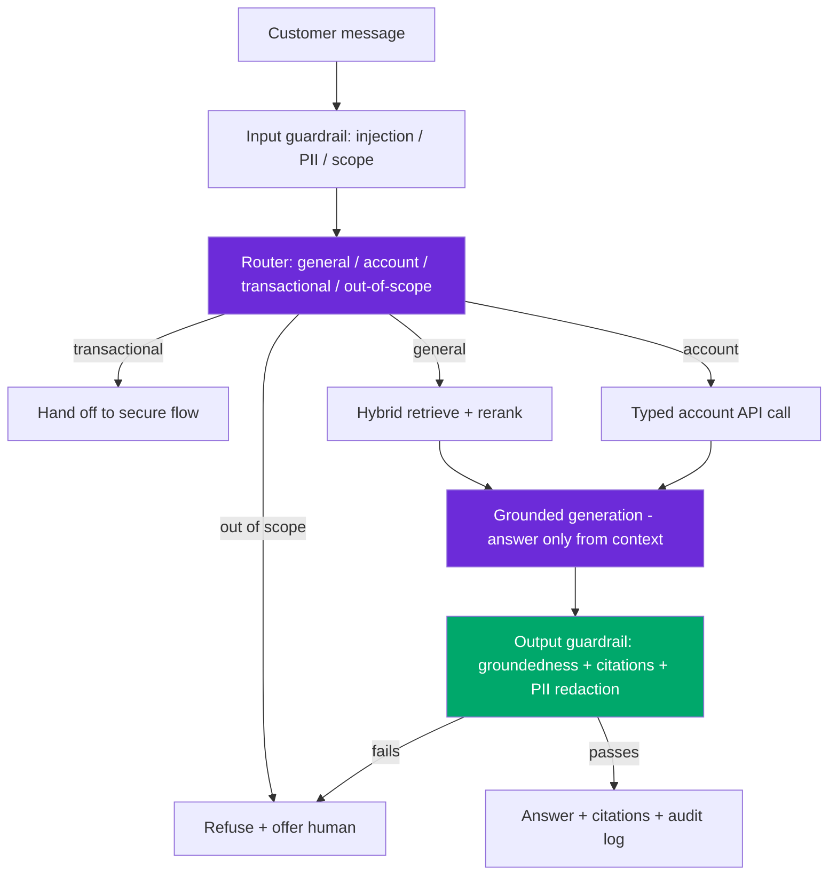

# Design: Hallucination-Free Banking Chatbot

> Worked answer using the [AI System-Design Rubric](system-design-rubric.md). Regulated finance, grounded-or-refuse, p99 ≤ 2 s.

**Prompt.** *"Design a hallucination-free banking chatbot."*

**Provenance.** ✅ **Reported** — design prompt **I**, from "Every AI Engineer Interview Question You Need in 2026, from 100 Real Interviews" ([Adil Shamim, Medium](https://adilshamim8.medium.com/every-ai-engineer-interview-question-you-need-to-know-in-2026-from-100-real-interviews-b5b7ae4b961a)).

---

## Stage 1 — Problem framing

The first senior move is to **reframe the premise**: no LLM is provably "hallucination-free." What you can build is a **grounded-or-refuse** system where every factual claim is backed by a retrieved, authoritative source — and the system **abstains** rather than guesses. Say this out loud; it's the whole round.

| Axis | Assumption (state + confirm) |
|------|------------------------------|
| Scope | Answer account/product/policy questions; two tiers — general (public docs) and account-specific (user's own data) |
| Scale | 5M customers, ~1M chats/day ≈ **12 avg / ~40 peak QPS** |
| Freshness | Rates/fees change daily; account balances real-time |
| Tenancy | Strict per-user data isolation; PII everywhere; SOC 2 / PCI / regulatory audit trail |
| Stakes | **Highest** — wrong financial info is legal liability + regulatory exposure; must log every answer |
| Latency | p50 ~900 ms, **p99 ≤ 2 s** (correctness > speed here) |

---

## Stage 2 — Data & eval set

The eval set is the deliverable — "eval is the new system design." Build **three graded slices**: (1) answerable-from-docs (must answer + cite), (2) **must-refuse** (out-of-policy: "should I buy this stock?", "what's my neighbor's balance?"), (3) adversarial (prompt injection, jailbreaks, social engineering). Targets: **faithfulness ≥ 0.98** (higher than a normal RAG bar — the stakes justify it), **false-refusal rate < 5%** (over-refusing kills the product), and **0 PII leaks / 0 cross-account leaks** as a hard gate. Grow the must-refuse set from every production near-miss.

---

## Stage 3 — Retrieval / model choice

**Baseline:** a scripted FAQ + intent classifier that deflects the top 50 questions. This alone handles a large share and is the floor the LLM must beat.

- **Router first:** classify each turn into `general_qa`, `account_specific`, `transactional`, or `out_of_scope`. Transactional and out-of-scope never reach the free-form LLM.
- **RAG over authoritative docs** for general Q&A: hybrid (dense + BM25 — rates, fees, and product codes are exact tokens embeddings blur) + contextual retrieval + cross-encoder rerank. Retrieve 50 → rerank → top 5.
- **Structured tool calls** for account data (balance, transactions) — never let the model *generate* a number; it calls a typed API and quotes the result verbatim.
- **Constrained generation:** the system prompt forces "answer only from provided context; if the context doesn't contain it, say you don't know and offer a human."
- **Cheapest model that clears the faithfulness bar** — a mid model + strong retrieval beats a giant-context call, and it's auditable.

---

## Stage 4 — Serving & latency

```
2 s p99 = input guardrail (injection/PII/scope) 60ms + router 40ms
        + hybrid retrieve + rerank 250ms + tool call (account API) 120ms
        + grounded generation 1000ms + output guardrail (groundedness/citation/PII) 200ms + buffer
```



---

## Stage 5 — Eval & guardrails

This is where the round is won. **Guardrails as an explicit, mandatory stage:**

| Layer | Control |
|-------|---------|
| Input | Prompt-injection classifier, PII scrub, scope check (indirect-injection baseline ASR is **73.2%**; layered defense → **8.7%**, but that's still ~1-in-12 — the output gate is non-negotiable) |
| Retrieval | Scan retrieved docs — inserted content flips a guardrail's judgment ~1-in-10 |
| Generation | Answer-only-from-context system prompt; abstain path |
| Output | **Groundedness check** — every claim entailed by a citation or the answer is blocked; PII redaction; no financial-advice classifier |
| Human gate | Anything transactional or high-uncertainty escalates to a human |

**Groundedness verification** runs as a second-pass check (decompose answer → claim → entailment against cited context). Because RAGAS-style faithfulness goes null on numeric content (**83.5% on FinanceBench**), pair it with a calibrated binary LLM judge (cross-family, Cohen's κ ≥ 0.7) and exact-match verification for any quoted number.

---

## Stage 6 — Monitoring & cost

**Cost/month:**
```
per_chat ≈ (retrieve+rerank $0.002 + 2k in × $2.5/M + 300 out × $10/M + guardrail passes)
         ≈ ~$0.012/chat with double-pass groundedness
monthly  ≈ 1M/day × 30 × $0.012 ≈ $360k/mo → ~$200k with prompt caching + routing
```
**Monitor** the business KPI (deflection with **CSAT held**, escalation rate as counter-metric), plus **hallucination rate** sampled by human review, false-refusal rate, PII-leak alarms (zero-tolerance), and a full **audit log** of every (question, retrieved sources, answer, groundedness score) for regulators. "Watch accuracy on a hold-out" is the wrong answer — monitor the live groundedness and refusal distributions.

---

## Stage 7 — Scaling

- Shard the doc index; account data stays behind the typed API (no PII in the vector store).
- Multi-region with data residency; audit log is append-only and immutable.
- Graceful degradation: under load or low retrieval confidence, **refuse and route to human** rather than answer unsupported — the safe failure mode.

> [!WARNING]
> **Trap 1 — promising "zero hallucination."** No LLM guarantees it. The senior framing is grounded-or-refuse: cite or abstain, verify groundedness on output, and log everything. Claiming a model won't hallucinate signals inexperience.

> [!WARNING]
> **Trap 2 — letting the model generate numbers.** Balances, rates, and fees must come from a typed tool call and be quoted verbatim, never generated. And the lethal trifecta (private account data + untrusted input + external egress) must be broken — quarantine the data plane from any egress path.

---

## What a strong vs weak candidate says

| | Weak | Strong |
|-|------|--------|
| Premise | "I'll make it hallucination-free" | Reframes to grounded-or-refuse; cite-or-abstain; verify on output |
| Numbers | "The model answers the balance" | Typed tool call, quoted verbatim; never generated |
| Guardrails | "Add a content filter" | Input+retrieval+output+human layers; injection ASR 73%→8.7%, output gate mandatory |
| Eval | "Test some questions" | 3 slices incl. must-refuse + adversarial; faithfulness≥0.98; false-refusal<5% |
| Compliance | (silent) | Audit log of Q/sources/answer/score; PII zero-leak gate; data residency |

---

## Follow-ups they'll push on

- **"How do you measure hallucination without ground truth?"** → Groundedness (claim-entailment vs cited context) + sampled human review + must-refuse eval slice; exact-match on quoted numbers.
- **"A user tries to jailbreak it into giving stock advice."** → Scope router blocks out-of-policy intents before generation; no-financial-advice output classifier; log the attempt.
- **"The bot refuses too often."** → False-refusal is a tracked counter-metric; tune the abstain threshold and improve retrieval recall so it has grounds to answer.
- **"Rates changed this morning — stale answer risk?"** → CDC re-index on doc change; last-verified timestamp; time-filter stale content.
- **"Prove it's safe to auditors."** → Immutable audit log linking every answer to its sources and groundedness score; reproducible eval suite in CI.

---

<div align="center">

**Nav:** [← README](../README.md) · [System-Design Rubric](system-design-rubric.md)

<sub>Maintained by [Landed](https://landed.jobs) · No affiliation with the companies named. MIT-licensed. Updated 2026-07.</sub>

</div>
