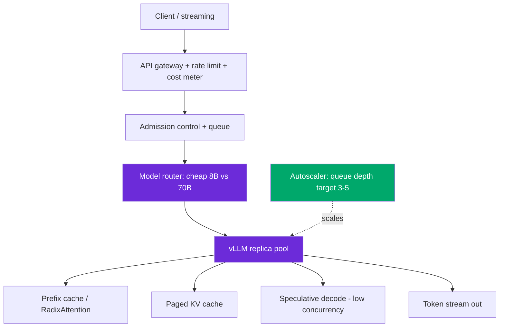

# Design: LLM Inference at Scale

> Worked answer using the [AI System-Design Rubric](system-design-rubric.md). ~10M requests/day, self-hosted 70B, p99 chat latency budget.

**Prompt.** *"Design LLM inference at scale — quantization, batching, KV cache, vLLM, autoscaling."*

**Provenance.** ✅ **Reported** — design prompt **C** from the AI-engineer loop research (dev.to "AI System Design Interview Questions" — [source](https://dev.to/arslan_ah/ai-system-design-interview-questions-chatgpt-rag-llm-inference-and-agents-1doi)); corroborated by company-specific prompts "Design a distributed LLM serving platform with autoscaling" (Microsoft AI) and "LLM serving system design" (Mistral).

---

## Stage 1 — Problem framing

Self-hosted inference is a **GPU-economics problem wearing a latency mask**. Lock the numbers first.

| Axis | Assumption (state + confirm) |
|------|------------------------------|
| Scope | Serve a 70B chat model behind an OpenAI-compatible API; streaming responses |
| Scale | 10M requests/day ≈ **116 avg QPS**, **~350 peak QPS**; median 2k input / 300 output tokens |
| Freshness | Model weights static between releases; no per-request training |
| Tenancy | Multi-tenant API; per-key rate limits + cost attribution |
| Stakes | Latency SLO breach = churn; a runaway cost bug = five-figure surprise |
| Latency | **TTFT p99 ≤ 300 ms**, **ITL p99 ≤ 50 ms** (interactive chat) |

The senior tell here is splitting the latency SLO into **two numbers**: TTFT (prefill, compute-bound) and ITL (decode, memory-bandwidth-bound). Conflating them is the most common mistake.

---

## Stage 2 — Data & eval set

You don't train here, but you **eval the serving stack**: a load-test corpus of realistic prompts (2k-token RAG prefixes + short user turns), a quality regression set (200 prompts scored for output equivalence across quantization levels), and a latency harness that reports TTFT/ITL percentiles at each QPS step. Quantization is only safe if the quality regression set holds: **FP8 on Mistral-7B shows ~0 perplexity delta; int4 GPTQ on 175B is +0.15 ppl; int3 is +0.54 ppl** — so int4 is the floor for quality, int3 is "must fit one GPU."

---

## Stage 3 — Model / serving-engine choice

**Baseline:** naive HuggingFace `generate()` with request-level batching. It works and is the bar to beat — and it's **8–23× slower** than the real answer.

**Memory math (do this out loud):**
```
70B params × 2 bytes (FP16) = 140 GB  → won't fit on 1×80GB H100
70B × 1 byte  (int8)        = 70 GB   → fits on 1×H100 with tight KV headroom
70B × 0.5 byte (int4 AWQ)   = 35 GB   → comfortable, big KV budget
```
Choose **FP8 on H100** (native tensor cores; ~0 ppl loss, +33% tokens/sec, −24% cost/Mtok) or **int4 AWQ** if you need one GPU. A 70B FP8 fits with room; below that, **tensor-parallel across 2×H100** with NVLink.

**KV cache** is the real memory pressure:
```
KV size = 2 × layers × kv_heads × head_dim × seq_len × batch × bytes
```
A 13B model burns **~1 MB of KV per token**; a 40GB A100 after weights holds only **~14k tokens ≈ 7 concurrent 2k-ctx requests**. Mitigations: **GQA/MQA** (fewer KV heads → proportional cache shrink), and PagedAttention.

**Serving engine — vLLM** for the throughput path:
- **PagedAttention** cuts KV waste **60–80% → <4%** (16-token pages, copy-on-write prefix sharing).
- **Continuous batching** reschedules after every forward pass: **23× throughput vs naive** (Anyscale, Llama-13B), saturating ~1900 tok/s at QPS~8.
- **Prefix caching** for the repeated 2k RAG prefix: justifiable at >5% prefix overlap; RadixAttention hit rates 52–99%.
- **Speculative decoding** for the low-concurrency latency path: `speedup ≈ K×α` (K=4–8 draft tokens, α=0.5–0.8) → **2–3×**, but it **evaporates at high batch** — reserve for batch ≤ 8.

---

## Stage 4 — Serving & latency

Per-stage budget for TTFT p99 = 300 ms:
```
300 ms = admission/queue 20ms + prefill(2k tok, cached prefix) 220ms + network 60ms
ITL 50ms = single KV-cache read per token (bandwidth-bound)
```

> [!NOTE]
> **"Why not just buy a bigger GPU to cut ITL?"** A bigger/faster GPU helps *prefill* (more compute) and *concurrency* (more requests in flight), but per-token decode is bounded below by the time to read the KV cache once — it's memory-bandwidth-limited. You cut ITL by shrinking the KV footprint (quantize, smaller model, GQA, speculative decoding), **not** by a faster chip.



**Model routing** — a Mixture-of-Models orchestrator sends easy queries to a cheap 8B and hard ones to the 70B. A router that always picks cheap is wrong 5–10% of the time; one that always picks smart is 3–10× more expensive. Instrument router *decisions* separately from *outcomes*.

---

## Stage 5 — Eval & guardrails

- **Quality gate on every quantization/engine change:** run the 200-prompt regression set; block if output-equivalence or the quality metric drops beyond tolerance.
- **Admission control** rejects/queues past a concurrency ceiling rather than letting the KV cache OOM.
- **Cost guardrail:** per-request token logging + a per-key budget cap. A silent bug with no cost alarm is a real war story.
- **Output guardrails** (toxicity, PII) run as a ~30 ms stage on the token stream.

---

## Stage 6 — Monitoring & cost

**Cost back-of-envelope** (self-hosted):
```
H100 on-demand ~$3.15/hr → $75.6/GPU/day
Say 6 H100 to hold p95 QPS with headroom → ~$453/day ≈ $13.6k/mo
10M req/day @ ~1 GPU-second/req on H100 ⇒ ~$0.001/req target
```
Prefix caching drops steady-state GPU util from ~70% → ~25%, letting one node serve 2–3× volume and **halving amortised $/1k-tokens**. Output tokens cost ~3–5× input, so the cheapest call is a big *cached* prompt + short output.

**Monitor:** TTFT/ITL percentiles per model, queue depth, KV-cache utilization, tokens/sec, GPU duty cycle, **$/1k-req**, and cache-hit rate. Alert on cost-per-request drift, not just errors.

---

## Stage 7 — Scaling

- **Autoscale on queue depth (target 3–5), never GPU memory** — vLLM preallocates the KV cache, so memory-used only scales up, never down.
- **Cold start is the hard floor:** an 8×H100 vLLM replica takes tens of seconds to load weights + capture CUDA graphs; serverless GPU has been measured at **460 s**. HPA/KEDA poll on 15–60 s and pods need 10–90 s ready — so you **cannot scale from zero inside a 1-min spike**. Keep a **min-replica buffer** (predictive baseline for the diurnal cycle + reactive elastic on top) and an atomic weight cache to dedupe downloads.
- **Graceful degradation** on a 10× spike: route to a cheaper model rather than time out; shadow any engine upgrade first.

> [!WARNING]
> **Trap 1 — OOM with free memory.** The cluster rejects requests with OOM while `nvidia-smi` shows GBs free. Cause: **KV-cache fragmentation** from contiguous max-length reservations. Fix is PagedAttention, not more GPUs.

> [!WARNING]
> **Trap 2 — scaling on GPU memory or utilization.** Both are the wrong signal for vLLM/TGI (preallocated cache; util measures active time not work). Scale on queue depth tied to a latency target — and keep a warm buffer because cold start blows any reactive-only plan.

---

## What a strong vs weak candidate says

| | Weak | Strong |
|-|------|--------|
| Latency | "It'll respond fast" | Splits TTFT (prefill/compute) vs ITL (decode/bandwidth); different levers |
| Throughput | "Batch the requests" | Continuous batching + PagedAttention = 8–23×; names KV-waste 60–80%→<4% |
| Memory | "Use a big GPU" | Params×bytes math; FP8/int4; KV = ~1MB/token; GQA to shrink it |
| Autoscale | "Add replicas on load" | Queue depth target 3–5, never GPU mem; min-replica buffer for 460s cold start |
| Cost | Silent | $/req back-of-envelope; prefix cache 70%→25% util; output tokens 3–5× input |

---

## Follow-ups they'll push on

- **"FP16 or FP8 on Hopper?"** → FP8 is ~2× throughput at ~0 ppl loss; running FP16 where FP8 works is wasted money.
- **"Model doesn't fit one GPU — now what?"** → tensor parallelism across GPUs (weight-matrix slices) with NVLink; combine with quantization first.
- **"Chat feels laggy after the first token."** → ITL problem; shrink KV (quantize/GQA/spec-decode), not more replicas.
- **"How do you serve 500 fine-tuned variants?"** → multi-LoRA: one base + hot-swapped ~17 MB adapters, shared KV/prefix cache.
- **"Prefill is starving decode under long prompts."** → chunked prefill (~512-token chunks) or prefill/decode disaggregation when TPOT binds and you have RDMA.

---

<div align="center">

**Nav:** [← README](../README.md) · [System-Design Rubric](system-design-rubric.md)

<sub>Maintained by [Landed](https://landed.jobs) · No affiliation with the companies named. MIT-licensed. Updated 2026-07.</sub>

</div>
