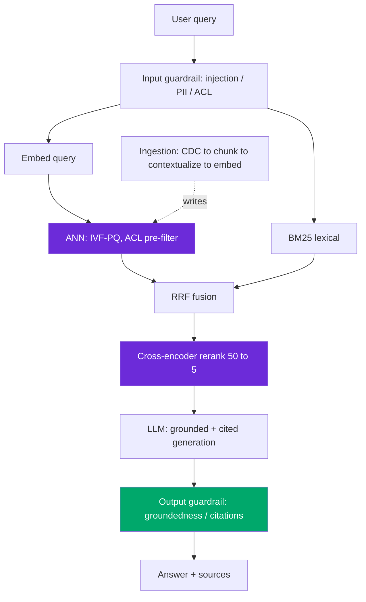

# Design: RAG over 10M Documents

> Worked answer using the [AI System-Design Rubric](system-design-rubric.md). ~10M docs → ~50M chunks, hybrid + rerank, p99 ≤ 1.5 s.

**Prompt.** *"Design a RAG system — ingestion, retrieval, reranking, and eval — over a 10M-document corpus."*

**Provenance.** 🔮 **Representative** — design prompt **B** from the AI-engineer loop research (dev.to "AI System Design Interview Questions" — [source](https://dev.to/arslan_ah/ai-system-design-interview-questions-chatgpt-rag-llm-inference-and-agents-1doi)); the single most common RAG round, corroborated by Perplexity's "vector-based retrieval-augmented search" prompt.

---

## Stage 1 — Problem framing

| Axis | Assumption (state + confirm) |
|------|------------------------------|
| Scope | Grounded Q&A over an enterprise doc corpus, with citations |
| Scale | 10M docs → **~50M chunks**; ~500k queries/day ≈ **6 avg / ~20 peak QPS** |
| Freshness | Docs change; new/edited docs must be searchable within minutes |
| Tenancy | Multi-tenant with per-doc ACLs — a wrong retrieval is a **data leak** |
| Stakes | Wrong/unsourced answer erodes trust; hallucination is the top failure |
| Latency | p50 ~700 ms, **p99 ≤ 1.5 s** end-to-end |

---

## Stage 2 — Data & eval set

Build the eval set **before** the pipeline. Harvest gold contexts from **production retrieval runs**, not hand-picked chunks — a team that hand-picked gold got 0.91 offline recall but **0.40 in production**, because they measured a corpus the live retriever never surfaced. Split eval into **retrieval** and **generation** (the 2×2 that localizes failure):

| Retrieval | Generation | Diagnosis | Fix |
|-----------|-----------|-----------|-----|
| ✓ | ✓ | working | — |
| ✗ | ✓ | wrong context retrieved | chunking / hybrid / rerank |
| ✓ | ✗ | model ignored context | grounding prompt |
| ✗ | ✗ | fix retrieval first | (generation can't exceed context) |

Targets: **recall@20 ≥ 0.95** (stage-1 ceiling — a miss here is unrecoverable), NDCG@10 for the reranker, **faithfulness ≥ 0.9** for generation. Golden set: 50–200 (query, gold-chunks, expected-answer) triples, binary pass/fail (Likert regresses to the middle), grown from production traces via error analysis.

---

## Stage 3 — Retrieval / model choice

**Baseline first:** BM25 alone. It's a top BEIR baseline and ships in a day; the fancy pipeline must beat it.

**Chunking:** ~512 tokens, 10–15% overlap, recursive split on structure. If precision@5 < 0.7, drop toward 256 tokens (sweet spot for entity lookups). Bigger chunks dilute — a 1,500-token chunk with 30 relevant tokens averages the query signal against 1,470 irrelevant ones.

**Embedding + RAM math** (the load-bearing number):
```
50M chunks × 1,536-d × 4 bytes = ~300 GB raw
HNSW adds a graph (1.5–2×)     = ~450–600 GB indexed  ← doesn't fit one box
```
So **IVF-PQ** at this scale: ~20× compression (1B×128-d benchmark: HNSW 1,408 GB vs IVF-PQ **70 GB**), recall 0.80–0.92, recovered by the reranker. Alternatively shard HNSW across nodes. Store a **Matryoshka-truncated 512-d** vector for fast stage-1 ANN, re-score with the full vector late.

**Hybrid + contextual retrieval** — dense misses exact tokens (error codes, SKUs, names, negation), BM25 misses paraphrase; fuse with **RRF** (`score = Σ 1/(60+rank)`). Anthropic's contextual retrieval stack (Haiku writes 50–100 tokens of context per chunk, indexed in both dense + BM25):

| Setup | Top-20 failure rate |
|-------|--------------------|
| Embeddings only | 5.7% |
| + contextual embeddings | 3.7% (**−35%**) |
| + contextual BM25 (hybrid) | 2.9% (**−49%**) |
| + reranker | 1.9% (**−67%**) |

Contextual indexing costs ~$1.02/M doc tokens, **~90% off with prompt caching**.

**Rerank:** retrieve 50–100 → **cross-encoder** → top 5. Cohere Rerank 3.5 lifts NDCG **+23.4% vs hybrid**; ~$2/1k searches, or self-host `bge-reranker` at ~50 ms/100 pairs.

---

## Stage 4 — Serving & latency

```
1.5 s p99 = embed query 15ms + ANN (IVF-PQ) 40ms + BM25 20ms
          + RRF fuse 5ms + cross-encoder rerank(50→5) 150ms
          + LLM generate (2k ctx, cited) 900ms + guardrail 40ms + buffer
```



**Ingestion** is a separate CDC-driven pipeline: on doc change, re-chunk → contextualize → embed → upsert. Re-embed **only changed rows** ($12k/mo per TB for a full reindex is the thing you're avoiding).

---

## Stage 5 — Eval & guardrails

- **ACL pre-filter before ANN** — `hybrid_search(query, k=50, acl_filter=user.acls)`. Retrieve-broadly-then-redact is a leak: the forbidden chunk is already in context and a prompt-injection payload can surface it.
- **Groundedness / faithfulness ≥ 0.9** via decomposed claim-checking (RAGAS), knowing it returns null on numeric/multi-hop (**83.5% null on FinanceBench**) — so pair with an LLM judge (binary, cross-family, calibrated to Cohen's κ ≥ 0.7).
- **Citations required** — every claim maps to a retrieved chunk or the answer is rejected.
- **Injection guardrail on retrieved content** too — inserted docs flip a guardrail's judgment ~1-in-10.

---

## Stage 6 — Monitoring & cost

**Cost/month:**
```
per_query = (rerank $0.002 + 2k in × $2.5/M + 300 out × $10/M) × (1 − cache_hit 0.4)
          ≈ ($0.002 + $0.005 + $0.003) × 0.6 ≈ $0.006
monthly   = 500k/day × 30 × $0.006 ≈ $90k/mo  → ~$54k after semantic cache
```
Redis semantic caching + model routing cut LLM spend **~5×** in production. **Monitor** freshness as a first-class metric: **top-k overlap** on a fixed probe set catches silent drift (a documented case fell recall 0.92 → 0.74 with nothing in dashboards) that end-to-end accuracy misses.

---

## Stage 7 — Scaling

- **Index sharding** by tenant/hash; IVF-PQ keeps RAM tractable at 50M+ vectors; DiskANN for a cold long tail on SSD.
- **Never mix embedding generations** in one index — new vectors aren't cosine-comparable to old ("representation shearing" shears recall silently). Migrate via **dual indexes** (old + new in parallel, shift traffic once new validates).
- **Deletes** must propagate — ANN tombstones rather than truly removing; schedule compaction.

> [!WARNING]
> **Trap 1 — swapping the embedding model casually.** You are *married* to your embedding model; a swap invalidates every stored vector and forces a full paid re-embed. Never mix generations; migrate with dual indexes.

> [!WARNING]
> **Trap 2 — analyzer bugs kill hybrid.** A default analyzer that lowercases and strips hyphens turns `"E-1042"` into nothing, erasing BM25's exact-match advantage. The hybrid gotcha is analyzer config, not fusion math. And filter *before* ANN — post-filtering wrecks recall and returns < k.

---

## What a strong vs weak candidate says

| | Weak | Strong |
|-|------|--------|
| Index | "Use a vector DB" | 50M×1536×4 = 300GB → IVF-PQ (70GB) + rerank recovers recall |
| Retrieval | "Embed and search" | Hybrid dense+BM25 (they fail on different queries), RRF, contextual −49% |
| Rerank | "Return top-k" | Retrieve 50 → cross-encoder → 5; +23.4% NDCG; only helps if gold is in shortlist |
| Eval | "Measure accuracy" | Split retrieval/generation 2×2; gold from production; recall@20≥0.95 |
| Security | "Filter results" | ACL pre-filter before ANN; injection guardrail on retrieved docs |

---

## Follow-ups they'll push on

- **"Is RAG still relevant with long-context models?"** → Yes — a giant-context call is expensive, super-linear, and degrades (lost-in-the-middle); retrieval + rerank beats it at ~20% cost. Reserve big-context for holistic single-doc tasks.
- **"Recall dropped and nothing changed."** → The three clocks (doc / embedding / chunking) drifted; check top-k overlap and last-verified timestamps.
- **"Numeric/table questions fail."** → Faithfulness metrics go null on numeric multi-hop; parser fragmenting tables tanks precision — split eval catches it.
- **"Cut cost 50%."** → Semantic cache (5% of queries drive 80% of retrievals), route easy factoids to a small model, prompt-cache the contextualization.
- **"Cold-start a brand-new tenant."** → Namespace-per-tenant isolation; index their docs on onboarding; fall back to a shared public index until ready.

---

<div align="center">

**Nav:** [← README](../README.md) · [System-Design Rubric](system-design-rubric.md)

<sub>Maintained by [Landed](https://landed.jobs) · No affiliation with the companies named. MIT-licensed. Updated 2026-07.</sub>

</div>
