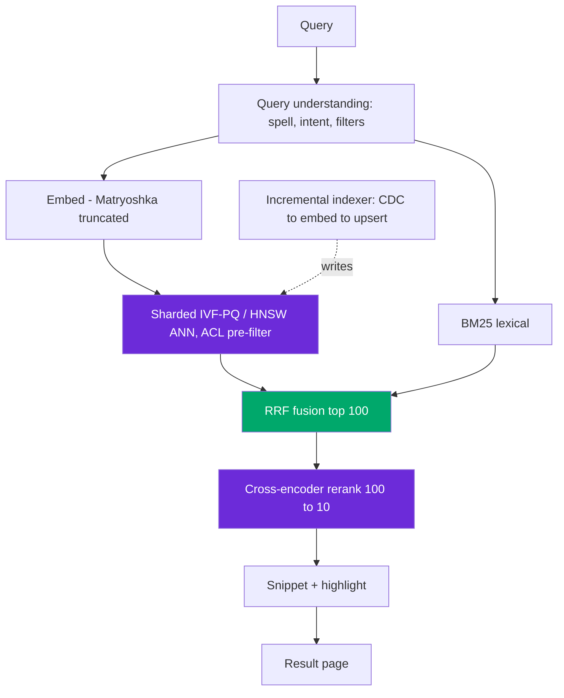

# Design: Semantic Search Engine

> Worked answer using the [AI System-Design Rubric](system-design-rubric.md). Web-scale hybrid search, p50 ~350 ms, p95 ~750 ms.

**Prompt.** *"Design a semantic (vector-based retrieval-augmented) search system."*

**Provenance.** 🔮 **Representative** — a Perplexity reported prompt ("design a vector-based retrieval-augmented search system") and a common general round. Grounded in Perplexity's published serving numbers (200M queries/day, p50 358 ms).

---

## Stage 1 — Problem framing

Semantic search is **retrieval without a generation step (usually)** — the product is the *ranked result list*, so ranking quality and latency dominate. Distinguish it from RAG: here the user reads the results; there's no LLM answer to ground.

| Axis | Assumption (state + confirm) |
|------|------------------------------|
| Scope | Query → ranked list of documents/passages with snippets |
| Scale | 500M docs; **200M queries/day** ≈ 2.3k avg / ~8k peak QPS |
| Freshness | New/changed docs indexed within minutes (news-like); tens of thousands of updates/sec at the top end |
| Tenancy | Public + per-user private corpora (ACL) |
| Stakes | Wrong top result = lost trust; not safety-critical |
| Latency | **p50 ~350 ms, p95 ~750 ms** (Perplexity's real numbers) |

---

## Stage 2 — Data & eval set

No LLM label, so the eval is pure **IR**: golden (query, relevant-docs) judgments, harvested from **production click/dwell logs** plus human relevance labels. Metrics by stage:

| Metric | Rewards | Use for |
|--------|---------|---------|
| **Recall@k** | gold anywhere in top-k | stage-1 ceiling (unrecoverable miss) |
| **MRR** | first relevant ranked high | one-right-answer queries |
| **NDCG@k** | graded relevance, position-discounted | reranker quality |
| **Precision@k** | share of top-k relevant | snippet/result-page noise |

Targets: **recall@100 ≥ 0.95** stage-1, NDCG@10 for ranking. Online: click-through + dwell + query-reformulation rate (the counter-metric — reformulation means we failed).

---

## Stage 3 — Retrieval / model choice

**Baseline:** BM25. It's a top BEIR baseline and tuned BM25 ties generic dense models on many corpora — the semantic layer must beat it.

- **Hybrid is mandatory.** Dense misses exact tokens (SKUs, error codes, proper nouns, negation); BM25 misses paraphrase. They fail on **different queries** — fuse with **RRF** (`Σ 1/(60+rank)`, cap each list at ~50). Hybrid lifts NDCG **+7.4% (WANDS), +9 pts (BEIR)** over either alone.
- **Index + RAM math:**
```
500M docs × 768-d × 4 bytes = ~1.5 TB raw → shard it
→ IVF-PQ ~20× compression ≈ 75 GB, recall 0.80–0.92
→ HNSW for the hot/recent shard (best recall, 1.5–2× RAM)
```
- **Co-locate lexical + dense + docs on the same nodes** (Vespa-style) — avoids a network hop and consistency headaches of stitching a separate vector DB + keyword engine. Perplexity runs 200B+ URLs, 400 PB hot, tens of thousands of updates/sec this way.
- **Rerank** the fused top 50–100 with a cross-encoder → top 10 (+23% NDCG), truncating passages to ~512 tokens to bound cost.
- **Learned sparse (SPLADE)** as an option — BM25's exact-match strength + synonym expansion.

---

## Stage 4 — Serving & latency

```
750 ms p95 = query understand/embed 20ms + BM25 30ms
           + sharded ANN scatter-gather 120ms + RRF 5ms
           + cross-encoder rerank(100→10) 200ms + snippet gen 80ms + buffer
```



**Semantic query cache** — ~5% of queries drive ~80% of retrievals, so cache hot queries (scope per intent; skip where freshness matters). **Store a Matryoshka-truncated 256-d vector** for fast stage-1 ANN, re-score with the full vector late.

---

## Stage 5 — Eval & guardrails

- **ACL pre-filter before ANN** — private-corpus results only for permitted users; post-filtering returns < k and leaks/breaks recall.
- **Query understanding** — spell-correct, detect the exact-token case (route to BM25 weight), handle the analyzer gotcha (a lowercasing/hyphen-stripping analyzer turns `"E-1042"` into nothing, killing exact match).
- **Freshness guardrail** — last-verified timestamp; time-filter stale content.

---

## Stage 6 — Monitoring & cost

Cost is mostly **infra (resident vector RAM + rerank compute)**, not tokens. **Monitor** the online KPI (click/dwell, and reformulation-rate as counter-metric), NDCG on a probe set, and **top-k overlap** on a fixed probe set to catch silent index drift (a documented case fell recall 0.92 → 0.74 with nothing in dashboards). Watch the **slowest shard's p99** — it bounds scatter-gather latency.

```
cost ≈ ANN shard RAM (75 GB–1.5 TB across shards) + rerank GPU + BM25 cluster
     + embedding refresh via CDC (re-embed only changed docs)
```

---

## Stage 7 — Scaling

- **Shard by hash/recency**; hot recent shard on HNSW, cold tail on IVF-PQ or DiskANN (SSD).
- **Never mix embedding generations** (representation shearing) — migrate via dual indexes.
- **Deletes** tombstone in ANN; schedule compaction. Multi-region for latency + residency.

> [!WARNING]
> **Trap 1 — pure dense search.** Dense embeddings are a lossy compression that discards exactly the rare exact tokens (codes, names, dates, negation) users search for. Pure vector search silently fails those queries; hybrid + RRF is non-negotiable, and the real bug is usually an analyzer config, not fusion.

> [!WARNING]
> **Trap 2 — filtering after the ANN walk.** Metadata/ACL post-filtering wraps up the candidate set first, so a selective filter returns fewer than k. Pre-filter or partition by common filter values; over-fetch with a larger k as a fallback.

---

## What a strong vs weak candidate says

| | Weak | Strong |
|-|------|--------|
| Retrieval | "Embed and cosine-search" | Hybrid dense+BM25 (fail on different queries), RRF, +9 pts NDCG |
| Index | "Use a vector DB" | 500M×768×4=1.5TB → IVF-PQ 75GB sharded; co-locate lexical+dense |
| Rerank | "Return the top hits" | Retrieve 100 → cross-encoder → 10; +23% NDCG; truncate passages |
| Latency | "It'll be fast" | p50 350/p95 750 budget; scatter-gather bounded by slowest shard; query cache |
| Freshness | "Re-index nightly" | CDC incremental; top-k overlap drift monitor; never mix embedding gens |

---

## Follow-ups they'll push on

- **"Why not just a bigger embedding model?"** → Dimension is a first-order RAM cost (1536→3072 doubles RAM); test domain fit on your data, not MTEB rank; use Matryoshka truncation.
- **"Search for an error code returns garbage."** → Embeddings blur exact tokens; BM25 hybrid + fix the analyzer (hyphen/case).
- **"How do you keep 500M vectors fresh at 10k updates/sec?"** → Co-located incremental indexer, CDC re-embed changed docs, tombstone deletes + compaction.
- **"Cut p99."** → Semantic cache hot queries, Matryoshka stage-1, balance shard sizes (slowest bounds tail), rerank fewer/shorter passages.
- **"When is a reranker not worth it?"** → When recall@k is broken (gold isn't retrieved) it can't recover; fix recall first, then add rerank for precision.

---

<div align="center">

**Nav:** [← README](../README.md) · [System-Design Rubric](system-design-rubric.md)

<sub>Maintained by [Landed](https://landed.jobs) · No affiliation with the companies named. MIT-licensed. Updated 2026-07.</sub>

</div>
