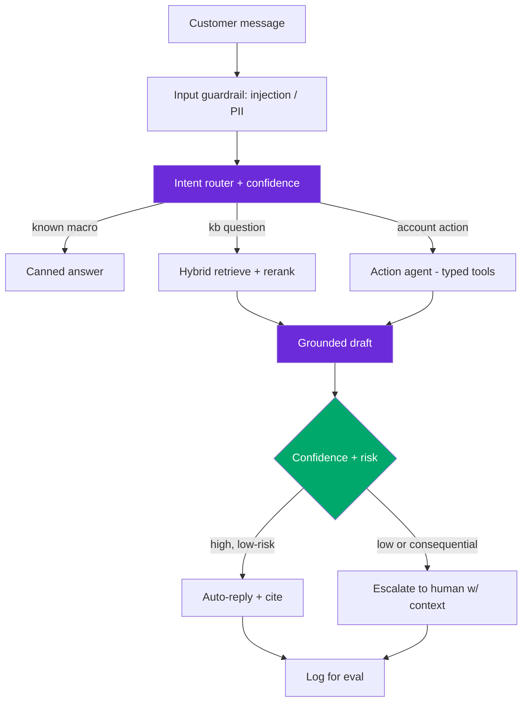

# Design: Customer Support Bot (RAG + Actions)

> Worked answer using the [AI System-Design Rubric](system-design-rubric.md). Deflect tickets, escalate hard ones, p99 ≤ 2 s.

**Prompt.** *"Design a customer support chatbot using RAG that answers questions, drafts responses, and escalates complex issues."*

**Provenance.** ✅ **Reported** — design prompt **G**, from the AI-engineering field guide's system-design set ([alexeygrigorev/ai-engineering-field-guide](https://github.com/alexeygrigorev/ai-engineering-field-guide/blob/main/interview/questions/04-ai-system-design.md)); corroborated by the "design an agent analyzing support tickets, drafting responses, escalating" prompt from the 100-interviews list.

---

## Stage 1 — Problem framing

A support bot is **RAG + a small action agent + an escalation policy**. The metric that matters is **deflection with CSAT held** — deflecting by giving wrong answers is worse than not deflecting.

| Axis | Assumption (state + confirm) |
|------|------------------------------|
| Scope | Answer from help-center + account context; draft agent replies; escalate on low confidence |
| Scale | 200k conversations/day ≈ **2.3 avg / ~8 peak QPS**; multi-turn (avg ~5 turns) |
| Freshness | Help docs change weekly; account/order state real-time |
| Tenancy | Per-customer data isolation; PII in tickets |
| Stakes | Wrong answer → bad CSAT + escalation cost; can trigger refunds/actions |
| Latency | p50 ~800 ms, **p99 ≤ 2 s** |

---

## Stage 2 — Data & eval set

Eval signal: **resolution** (did the customer stop replying / mark solved?) and **CSAT**, plus human agent thumbs on drafts. Build a golden set from **real historical tickets** with known resolutions — 200 (ticket, ideal-answer, correct-action, should-escalate?) cases, binary-graded. Track **containment rate** (resolved without human), **false-deflection** (bot said solved but customer re-opened) as the counter-metric, and **escalation precision** (did it escalate the right ones?). Grade the **trajectory**, not just the end state — a bot that resolved via 7 tool calls where 3 would do is 43% efficient and expensive.

---

## Stage 3 — Retrieval / model choice

**Baseline:** intent classifier → canned macro for the top 30 intents + article links. Ships fast, deflects the easy tail, and is the bar.

- **RAG over help center:** hybrid (dense + BM25) + rerank; retrieve 50 → cross-encoder → top 5. Contextual retrieval on the KB (−49% top-20 failures).
- **Action agent** for order/account operations via **typed tools** (`get_order`, `issue_refund`, `update_address`) — small tool set (< 20; past 20–40, selection accuracy degrades). Return handles, not blobs. Errors classified TRANSIENT / PERMANENT / REQUIRES_HUMAN.
- **Draft mode vs auto-send:** for anything consequential, the bot **drafts** and a human approves (tiered approval — gate the *write*, not the thought).
- **Confidence-gated escalation:** low retrieval confidence, detected frustration, or a Tier-3 action → hand to a human with full context.

Reliability math: if each step is 95% reliable, a 5-step resolution is `0.95^5 ≈ 77%` end-to-end — so bound the loop and verify against a real scorer.

---

## Stage 4 — Serving & latency

```
2 s p99 = input guardrail 40ms + intent/router 40ms
        + hybrid retrieve + rerank 250ms + (optional tool call) 150ms
        + grounded draft generation 1100ms + output guardrail 150ms + buffer
```



---

## Stage 5 — Eval & guardrails

- **Groundedness** — answers cite a KB article; ungrounded claims blocked.
- **Escalation as a safety valve** — better to escalate than to hallucinate a policy. Escalation precision + recall both tracked.
- **Action guardrails** — refunds/cancellations above a threshold require human approval (Tier-3 hard-gate); tool args validated; least privilege.
- **Injection defense** — a customer (or a poisoned pasted email) trying to make the bot issue a refund it shouldn't; input + retrieval guardrails.
- **Trajectory eval** in CI — Notion went from 3 → 30 fixes/day by grading trajectories, not just outputs.

---

## Stage 6 — Monitoring & cost

**Cost/month:**
```
per_convo ≈ 5 turns × (retrieve+rerank + ~1.5k in × $2.5/M + 250 out × $10/M)
          ≈ ~$0.03/convo (multi-turn re-sends transcript → super-linear input)
monthly   ≈ 200k/day × 30 × $0.03 ≈ $180k/mo → less with prompt caching on the KB prefix
```
Cache the stable system + retrieved-KB prefix (0.1× reads). **Monitor** containment rate, CSAT, false-deflection (the counter-metric), **cost-per-resolved-ticket** and **steps-per-ticket** (leading regression signals — a prompt tweak that adds a tool call shows in cost before quality), escalation rate, and per-intent success. Shadow → canary (1–5%) → full for every prompt/model change; alarm on cost step-changes vs the 7-day median.

---

## Stage 7 — Scaling

- Shard the KB index by product/tenant; account data behind typed APIs.
- **Graceful degradation:** under load or model outage, fall back to macros + "an agent will reply" rather than time out.
- Human-in-the-loop capacity is the real bottleneck at 10× — tune the escalation threshold to protect agent queues.

> [!WARNING]
> **Trap 1 — deflection at the cost of CSAT.** Optimizing containment alone rewards confidently-wrong answers. Deflection must be paired with a false-deflection / CSAT counter-metric, and low-confidence turns must escalate, not guess.

> [!WARNING]
> **Trap 2 — auto-executing consequential actions.** Letting the agent issue refunds or cancel accounts autonomously is a blast-radius and injection risk. Gate every consequential *write* behind a human or an allow-list; draft-then-approve for anything irreversible.

---

## What a strong vs weak candidate says

| | Weak | Strong |
|-|------|--------|
| Metric | "Maximize deflection" | Deflection *with CSAT held*; false-deflection counter-metric |
| Actions | "The bot handles refunds" | Typed tools, classified errors, Tier-3 writes human-gated |
| Escalation | "Escalate if it can't answer" | Confidence + frustration + risk gate; escalation precision/recall tracked |
| Eval | "Check answers" | Trajectory-graded on real tickets; pass^k; CI gate |
| Cost | (silent) | Cost/resolved-ticket + steps/ticket as leading signals; prompt-cache KB prefix |

---

## Follow-ups they'll push on

- **"How do you evaluate a multi-turn agent where success is end-state?"** → Trajectory grading + end-state check; pass^k on golden tickets; log disagreements to grow the set.
- **"The bot loops or re-asks the same thing."** → Step cap + semantic loop detection + progress detection (no new info in K steps → escalate).
- **"A customer pastes a poisoned email to trick a refund."** → Indirect injection; retrieval/input guardrails; refunds hard-gated regardless of what the text says.
- **"Cut cost."** → Prompt-cache the KB prefix, trim stale turns, route easy intents to a small model, macros for the top tail.
- **"Draft quality dropped after a model upgrade."** → CI eval gate on pinned versions catches it; diff trajectories; roll back.

---

<div align="center">

**Nav:** [← README](../README.md) · [System-Design Rubric](system-design-rubric.md)

<sub>Maintained by [Landed](https://landed.jobs) · No affiliation with the companies named. MIT-licensed. Updated 2026-07.</sub>

</div>
