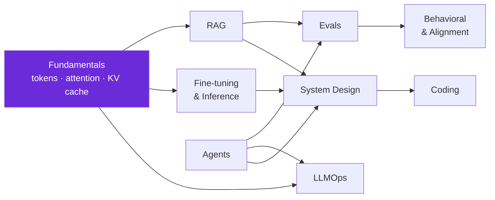

<div align="center">


# The AI Engineer Interview Question Bank

**267 tiered, topic-grouped questions — self-test multiple choice with per-option "why," plus real reported questions with sources.**

[](.)
[](.)
[](#whats-new)
[](../LICENSE)
[](https://landed.jobs)

*Maintained by [Landed](https://landed.jobs) — scout AI-native roles, get **referred**, prep with mock interviews, and land the job.*

</div>

---

**This is the most complete AI-engineer interview question bank on the internet, and it is built to be *studied*, not skimmed.** Every one of the **196 checkpoint questions** is multiple choice with a hidden answer key that explains *why each option is right or wrong* — so you can self-test first and learn from the distractors, which encode the exact misconceptions interviewers listen for. On top of those, **71 real reported questions** carry a source link, and the system-design file lists the **10 concrete whiteboard prompts** you'll actually get. Dated for **2026**: reasoning models, MCP, agentic eval, context engineering, the lethal trifecta, GRPO/DPO, FP8, and "eval is the new system design."

> ⭐ **Star this repo** if it helps — it's the fastest way to keep the 2026 updates coming.

---

## How the bank is organized



---

## Contents — files & live counts

| # | Topic file | Questions | Checkpoints 🔮 | Reported ✅ | What it covers |
|---|------------|:---------:|:--------------:|:-----------:|----------------|
| 1 | [**fundamentals.md**](./fundamentals.md) | **50** | 50 | — | LLM behavior, determinism, prompting, structured outputs, transformer internals (tokenization, attention, RoPE, norms, KV cache, quantization, serving) |
| 2 | [**rag.md**](./rag.md) | **43** | 36 | 7 | Retrieval diagnosis, chunking/parsing, hybrid search + RRF, reranking, vector-index scale, RAG eval, multi-tenant safety, end-to-end design |
| 3 | [**agents.md**](./agents.md) | **29** | 20 | 9 | Tool design (ACI), single vs multi-agent, error compounding, MCP + gateways, memory & long-running state |
| 4 | [**evals.md**](./evals.md) | **19** | 10 | 9 | Trajectory vs outcome eval, pass^k, LLM-as-judge calibration, prompt-injection & security evals, the lethal trifecta |
| 5 | [**llmops.md**](./llmops.md) | **29** | 20 | 9 | Reliable clients (backoff/jitter/breaker/hedging), cost & latency, caching, testing probabilistic output, observability & rollout |
| 6 | [**fine-tuning.md**](./fine-tuning.md) | **40** | 30 | 10 | RAG-vs-FT-vs-prompt, data quality/contamination, LoRA/QLoRA/PEFT, DPO/RLHF/GRPO, serving & precision |
| 7 | [**system-design.md**](./system-design.md) | **40** | 30 | 10 | The interview spine, labels/feature stores, LLM serving latency, monitoring/rollout, funnel & fraud patterns — **plus the 10 concrete design prompts (A–J)** |
| 8 | [**coding.md**](./coding.md) | **8** | — | 8 | Implement-from-memory: attention, MHA, transformer block, LoRA adapter, bug-fix, ReAct loop, gRPC service, semantic cache |
| 9 | [**behavioral.md**](./behavioral.md) | **9** | — | 9 | Project ownership, disagreement, 90-days, and the Anthropic-flavored **safety/alignment debate** |
| | **Total** | **267** | **196** | **71** | |

---

## Legends (used in every file)

**Difficulty tiers** — assigned by what the question actually demands:

| Icon | Tier | When |
|------|------|------|
| 🟢 | **Easy** | Foundations, one concept, definitional |
| 🟡 | **Medium** | A tradeoff or a mechanism to reason through |
| 🔴 | **Hard** | Scale, security, multi-hop, memory-math, or a senior trap |

**Provenance** — every question is labeled so you know what you're looking at:

| Icon | Label | Meaning |
|------|-------|---------|
| 🔮 | **Representative** | Ours — extracted from the Landed course checkpoints, modeled on real loops. Multiple choice with a per-option "why." |
| ✅ | **Reported** | Observed in a real interview, with a source link. Open prompts with a senior framing. |

---

## The question format (and why it's built this way)

Every checkpoint follows the same **progressive-disclosure** shape so you can *self-test before you see the answer* — the single biggest lever for retention:

```markdown
### Q7. <the question — a realistic production scenario>
> Difficulty: 🟡 Medium · [topic tag] · 🔮 Representative

- <option A>
- ✅ <the correct option>
- <option C>

<details><summary>Show answer & why each option</summary>
- <A> — why it's wrong (the misconception it encodes)
- ✅ <correct> — why it's right
- <C> — why it's wrong
</details>
```

Read the scenario, **commit to an answer**, *then* open the fold. The wrong options are never filler: each is a real trap an interviewer is probing for. The "Reported" questions instead give a `> Senior frame:` pointer — rehearse a 60–90 second spoken answer.

---

## Suggested study order

You don't have to go in file order. Pick the path that matches your loop:

1. **Start with [fundamentals.md](./fundamentals.md)** — everything else assumes you can reason about tokens, attention, KV cache, and determinism from first principles. If these aren't automatic, the applied rounds collapse.
2. **Then your role's core:** applied AI-engineer → [rag.md](./rag.md) → [agents.md](./agents.md) → [evals.md](./evals.md) → [llmops.md](./llmops.md). LLM/research-leaning → [fine-tuning.md](./fine-tuning.md) next.
3. **[system-design.md](./system-design.md)** — the signature onsite. Do the 30 checkpoints, then rehearse the **10 whiteboard prompts (A–J)** out loud against the rubric in [`content/system-design.md`](../content/07-ml-and-llm-system-design.md).
4. **[coding.md](./coding.md)** — set a timer and implement from memory; don't read the outline first.
5. **[behavioral.md](./behavioral.md)** — prep 2–3 flexible STAR stories and an *actual* view on the alignment prompts (Anthropic adds a debate round).

> [!TIP]
> **Spaced repetition beats cramming.** Do 10–15 checkpoints a day across two files, always answering before you open the fold. Re-do the ones you missed 48 hours later — the per-option "why" is written to make the miss stick.

> [!NOTE]
> Counts are **live** — the table above reflects the files as shipped. 196 self-test checkpoints + 71 reported = **267 total**, comfortably past the 150+ bar, and the checkpoints span all 196 extracted course-content questions.

---

## What's new

- **2026-07** — Initial release. 267 questions across 9 topic files: 196 progressive-disclosure checkpoints (multiple choice + per-option "why") covering LLM features, transformer internals, RAG, agents, evals, LLMOps, fine-tuning, ML/LLM system design; 71 reported questions with sources; the 10 whiteboard design prompts; 8 implement-from-memory coding patterns; and the Anthropic-flavored alignment round. Dated for 2026 topics: reasoning models, MCP, agentic eval, context engineering, lethal trifecta, GRPO/DPO, FP8, "eval is the new system design."

---

## FAQ

**Do I need an ML PhD to pass an AI-engineer loop?**
No. Most 2026 AI-engineer loops (vs research-scientist loops) grade end-to-end *building* — RAG, agents, evals, serving, cost — far more than novel research. This bank is built for exactly that. The research-leaning depth lives in [fine-tuning.md](./fine-tuning.md) if your target lab wants it.

**How long should I prepare?**
With a working AI-engineering background, 2–4 weeks of daily checkpoints plus rehearsing the design prompts is typical. Cold, budget 6–8 weeks and start at [fundamentals.md](./fundamentals.md).

**Are these the *actual* questions I'll get?**
The 71 **✅ Reported** questions are real, from public write-ups (linked). The 196 **🔮 Representative** checkpoints are ours — modeled on real loops to teach the *reasoning* interviewers probe, not to leak a specific company's set. Learning the "why" transfers; memorizing a leaked list does not.

**Is fine-tuning still worth learning in 2026 when RAG and long context exist?**
Yes — but know *when* each applies: RAG for volatile/citable knowledge, fine-tuning for stable behaviour (format/tone/tools) or a capability shift, prompting for per-turn rules. That decision itself is a top reported question ([fine-tuning.md](./fine-tuning.md) Q1–Q5, Q35).

**What's the single highest-signal topic in 2026?**
Evals. "Eval is the new system design" — teams now treat evals as first-class deployment gates. Even the RAG and agent rounds increasingly hinge on *how you'd measure it*. Start [evals.md](./evals.md) early.

**Why multiple choice with explanations instead of flashcards?**
Because the distractors *are* the lesson. Each wrong option is a real misconception an interviewer listens for; seeing why it's wrong is what makes the right answer stick.

---

## Contributing

Found a question that's dated, or have a **✅ Reported** question with a source? See [CONTRIBUTING.md](../CONTRIBUTING.md) — we hold a high quality bar (provenance labels, per-option "why," difficulty tiering). PRs that add real sourced questions or sharpen an explanation are especially welcome.

---

### Part of the Landed AI-native jobs family

This question bank is one repo in the **[Landed](https://landed.jobs)** family for AI-native job seekers:
- 🧭 [**awesome-ai-native-jobs**](https://github.com/landedjobs/awesome-ai-native-jobs) — the umbrella: roles, companies, and the AI-native hiring map
- 💻 [**awesome-ai-engineer-interview**](../README.md) — *(you are here)* the flagship interview-prep repo
- 📚 sibling topic repos on RAG, agents, and LLMOps prep

<div align="center">

### Don't just apply. Get **referred**, get **prepped**, get **Landed**.

[](https://landed.jobs)

<sub>Maintained by [Landed](https://landed.jobs) · No affiliation with the companies named. Content MIT-licensed.</sub>

</div>
